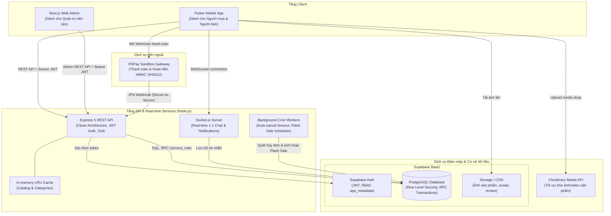
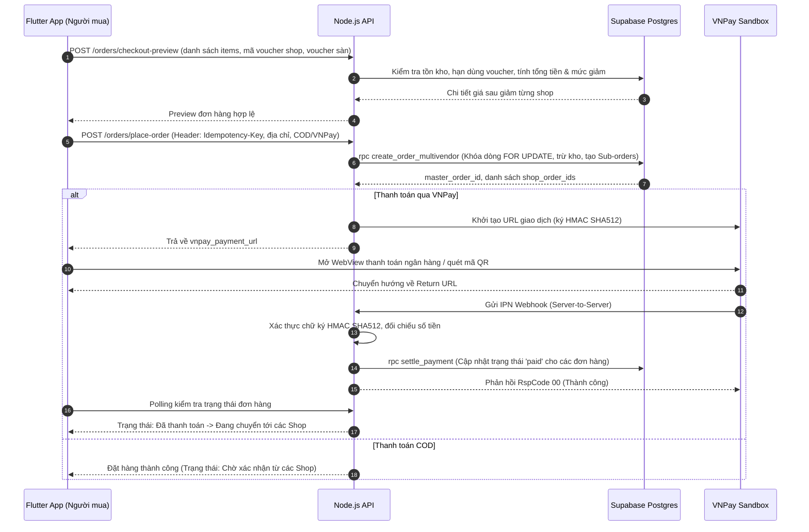
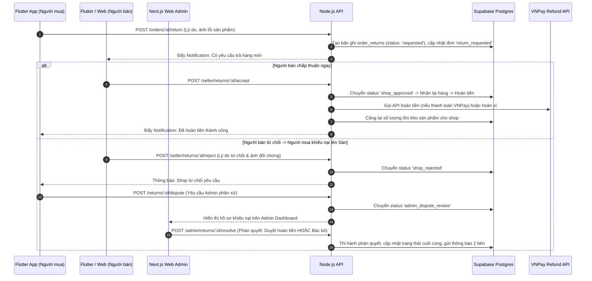
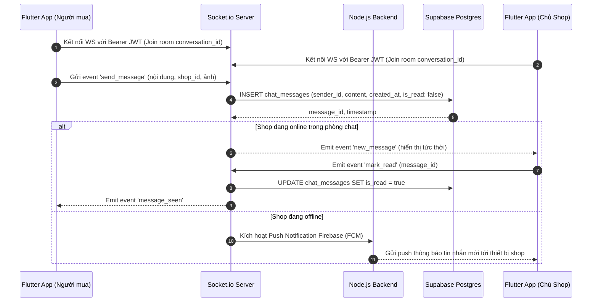
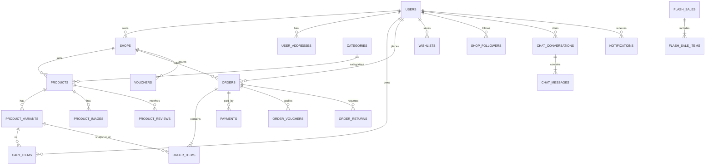
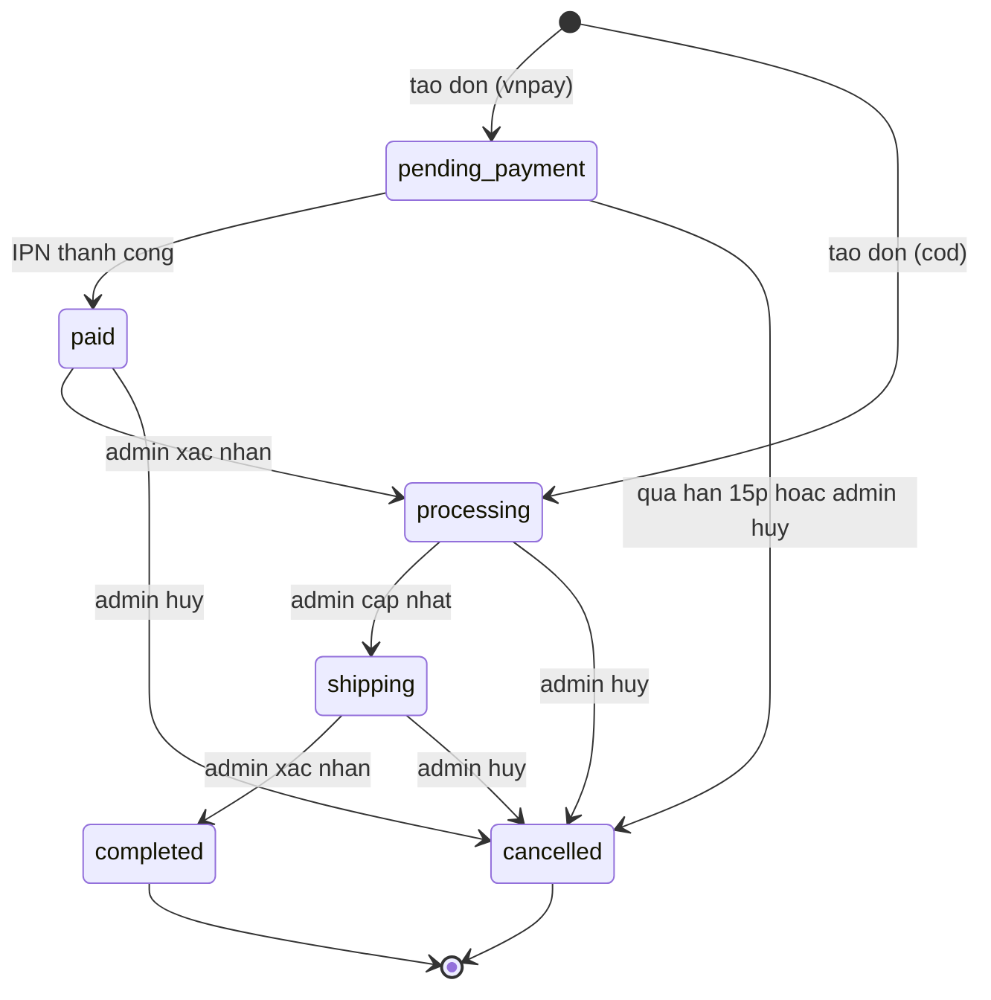
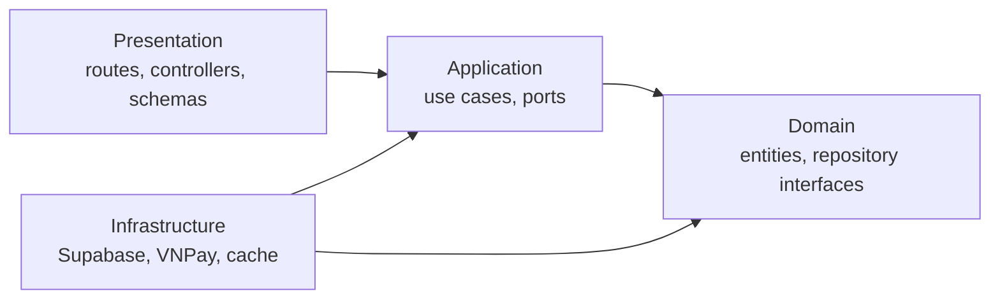
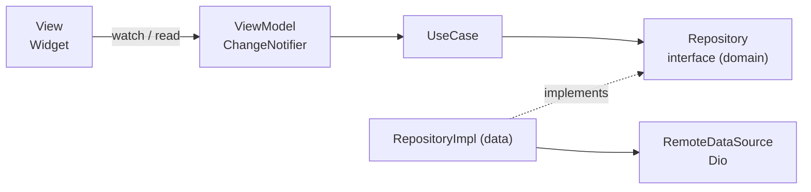

# Menly (MenShop) - Tài liệu kỹ thuật Sàn thương mại điện tử mua sắm thời trang nam

Phiên bản 2.0 | 28/09/2026 | Phạm vi: Đồ án tốt nghiệp (Sàn TMĐT đa người bán, nhóm 5 thành viên)

Công nghệ: Flutter (Mobile App Buyer & Seller), Next.js (Web Admin Dashboard), Node.js (Clean Architecture & Express 5), Socket.io (Real-time Chat), Supabase (Postgres & Auth), Cloudinary / Supabase Storage, VNPay (sandbox).
Kỹ năng áp dụng: System Design, Clean Architecture, MVVM, DSA (phân trang phía backend), quy tắc vibe coding không icon, tối ưu token khi dùng IDE agent.

---

## 0. Cách dùng tài liệu

- Tài liệu dành cho cả người đọc và IDE agent. Mỗi mục đọc độc lập được.
- Khi làm việc với agent, không đưa cả tài liệu vào ngữ cảnh. Tách thành các file trong `docs/` và chỉ tham chiếu mục cần (mục 10).
- Mục 9 và 10 là quy tắc làm việc với agent. Mục 11 là lộ trình giao việc từng bước.

Cấu trúc repo khuyến nghị và ánh xạ mục sang file:

```
menshop/
  AGENTS.md                 # quy tắc ngắn cho agent (mục 10.8)
  docs/
    overview.md             # mục 1-3
    db.md                   # mục 4
    backend.md              # mục 5-6 (kèm bảng API)
    flutter.md              # mục 7
    vnpay.md                # mục 8
    progress.md             # trạng thái làm việc, dùng khi mở phiên mới
  app/                      # Flutter
  backend/                  # Node.js
  supabase/migrations/      # SQL theo phiên bản
  scripts/check-emoji.sh    # mục 9
```

---

## 1. Tổng quan

### 1.1 Mục tiêu

Xây dựng hệ sinh thái ứng dụng mua sắm thời trang nam **Menly** (mô hình sàn thương mại điện tử đa người bán - Multi-vendor Marketplace kiểu Shopee/ViMard):
- Cho phép nhiều Cửa hàng (Shop/Người bán) tham gia đăng ký, mở gian hàng, đăng tải sản phẩm, quản lý tồn kho và xử lý đơn hàng.
- Cho phép Người mua (Khách hàng) khám phá sản phẩm, tìm kiếm, lọc size/màu, gom sản phẩm từ nhiều shop vào giỏ hàng chung, áp mã giảm giá kép (Shop + Sàn), thanh toán trực tuyến qua VNPay hoặc COD, theo dõi đơn hàng, chat trực tiếp với shop, đánh giá sản phẩm và yêu cầu đổi trả hàng.
- Cung cấp Kênh Quản trị sàn (Admin Portal) kiểm duyệt shop, duyệt sản phẩm, quản lý danh mục, tạo voucher toàn sàn, cấu hình banner trang chủ, phân xử khiếu nại đổi trả và giám sát toàn diện doanh thu.

### 1.2 Tác nhân hệ thống

Hệ thống phân định rõ ràng 3 cấp độ tác nhân cốt lõi cùng 2 tác nhân phụ trợ:

| Tác nhân | Vai trò và Quyền hạn |
|---|---|
| **Quản trị viên (Admin)** | **Quản lý toàn bộ hệ thống (Toàn quyền).** Nắm quyền lực cao nhất: quản lý toàn bộ tài khoản người dùng và nhân viên (tạo mới, sửa, tạm khóa / mở khóa tài khoản); phân quyền vai trò người dùng (`admin`, `staff`, `customer`); phê duyệt mở cửa hàng mới (Shop); giám sát toàn diện nhật ký kiểm toán hệ thống (Audit Logs); xem báo cáo tài chính, tổng doanh số toàn sàn (GMV); và có đầy đủ quyền can thiệp vào mọi khâu vận hành khi cần thiết. |
| **Nhân viên (Staff / Operations)** | **Quản lý vận hành hàng ngày.** Phụ trách trực tiếp quy trình vận hành sàn: tiếp nhận và xử lý đơn hàng (xác nhận, đóng gói, giao vận, hoàn tất hoặc hủy đơn có lý do); quản lý kho hàng và kiểm kê tồn kho (điều chỉnh tăng/giảm tồn kho SKU, xem nhật ký biến động kho `inventory_movements`); quản lý và kiểm duyệt sản phẩm/danh mục; quản lý chương trình khuyến mãi/banner theo kế hoạch vận hành; tiếp nhận và phân xử đổi trả / khiếu nại khách hàng; chat tư vấn CSKH trực tiếp. **Đặc biệt: Nhân viên có thể trực tiếp Đăng ký và Đăng nhập** tài khoản nhân viên vào hệ thống. **Giới hạn nghiêm ngặt:** Nhân viên **tuyệt đối không** được quản lý người dùng khác, **không** được phân quyền vai trò tài khoản, và **không** có quyền truy cập nhật ký kiểm toán hệ thống (Audit Logs - 403 Forbidden). |
| **Khách hàng (Customer / Buyer)** | **Xem, mua bán và tương tác.** Người dùng mua sắm chính thức: duyệt xem sản phẩm, tìm kiếm không dấu, lọc theo kích thước/màu sắc/khoảng giá; thêm vào giỏ hàng và đặt mua hàng (thanh toán COD hoặc chuyển khoản online qua VNPay); viết **comment và bình luận / đánh giá** sản phẩm (kèm số sao và ảnh); lưu sản phẩm **yêu thích (Wishlist)** để theo dõi; theo dõi Shop; tự **đăng ký và đăng nhập** tài khoản; quản lý thông tin cá nhân và sổ địa chỉ nhận hàng; yêu cầu trả hàng / hoàn tiền khi có sự cố. |
| **Khách vãng lai (Guest)** | Người dùng chưa đăng nhập (phiên Supabase Anonymous Auth). Được xem sản phẩm, tìm kiếm, lọc, xem trang shop, thêm vào giỏ, đặt hàng (COD/VNPay) và tra cứu tiến độ đơn qua Mã đơn + Số điện thoại nhận hàng. Có thể nâng cấp trực tiếp thành tài khoản Khách hàng chính thức mà không mất giỏ hàng và lịch sử đơn. |
| **Hệ thống ngoài (VNPay Sandbox)** | Cổng thanh toán trực tuyến: nhận lệnh khởi tạo giao dịch an toàn (HMAC SHA512), cung cấp giao diện thanh toán ngân hàng/QR, gửi kết quả thanh toán tức thời qua IPN Webhook và hỗ trợ hoàn tiền giao dịch. |


### 1.3 Phạm vi hệ thống

**Trong phạm vi đồ án:**
- Hoàn thiện toàn bộ hệ thống nghiệp vụ thương mại điện tử đa người bán theo quy trình khép kín: Đăng ký/đăng nhập → Quản lý gian hàng → Đăng & duyệt sản phẩm → Khám phá & Tìm kiếm → Giỏ hàng đa shop & Voucher kép → Đặt hàng nguyên tử → Cổng thanh toán VNPay & COD → Xử lý đơn hàng đa trạng thái → Đánh giá sau mua → Trả hàng/hoàn tiền & Trọng tài khiếu nại → Chat trực tiếp Socket.io & Thông báo đẩy → Dashboard báo cáo thống kê.
- Hỗ trợ cả Ứng dụng di động Flutter (dành cho Người mua và Người bán) và Kênh Quản trị Web Admin (Next.js dành cho Ban điều hành sàn).
- Cơ chế xử lý ngầm (Background Worker): Tự động giải phóng tồn kho cho đơn quá hạn thanh toán VNPay và tự động kích hoạt/kết thúc Flash Sale theo lịch trình.

**Hướng mở rộng trong tương lai (sau đồ án):**
- Tích hợp API định vị GPS và đơn vị vận chuyển bên thứ ba (GHN, GHTK, Viettel Post).
- Hệ thống Ví điện tử nội bộ tích lũy điểm thưởng (Loyalty Points / Cash Wallet).
- Công cụ gợi ý sản phẩm thông minh bằng AI / Machine Learning (Collaborative Filtering).

---

### 1.4 Danh mục Yêu cầu chức năng chi tiết (Mã UC01 – UC74)

Hệ thống được chuẩn hóa thành 74 Use Case thuộc 11 phân hệ nghiệp vụ:

#### Phân hệ 1: Xác thực & Quản lý Tài khoản (UC01 – UC08)
| Mã | Tên chức năng | Tác nhân | Mô tả tóm tắt |
|---|---|---|---|
| **UC01** | Đăng ký tài khoản | Khách hàng, Nhân viên | Đăng ký tài khoản Khách hàng mua sắm hoặc Nhân viên vận hành (`role: 'staff'`) qua Supabase Auth |
| **UC02** | Đăng nhập & Đăng xuất | Tất cả | Đăng nhập xác thực cấp JWT token (Admin, Nhân viên, Khách hàng); cơ chế chống brute-force khóa lũy tiến |
| **UC03** | Quên mật khẩu | Khách hàng, Nhân viên | Gửi liên kết hoặc mã OTP xác thực khôi phục mật khẩu qua Email |
| **UC04** | Đổi mật khẩu | Khách hàng, Nhân viên, Admin | Thay đổi mật khẩu khi đã đăng nhập (yêu cầu mật khẩu hiện tại) |
| **UC05** | Quản lý hồ sơ cá nhân | Khách hàng, Nhân viên, Admin | Xem và cập nhật họ tên, ảnh đại diện (avatar), SĐT, ngày sinh, giới tính |
| **UC06** | Quản lý sổ địa chỉ | Khách hàng | Thêm mới, chỉnh sửa, xóa và thiết lập địa chỉ nhận hàng mặc định |
| **UC07** | Nâng cấp tài khoản ẩn danh | Khách vãng lai | Gắn email/mật khẩu vào phiên khách vãng lai, chuyển đổi thành tài khoản Khách hàng chính thức |
| **UC08** | Đăng ký mở Cửa hàng (Shop) | Khách hàng | Nộp hồ sơ đăng ký bán hàng: tên shop, CCCD/MST, địa chỉ kho, mô tả |

#### Phân hệ 2: Quản trị Người dùng & Phân quyền (UC09 – UC12)
*(Độc quyền Quản trị viên tối cao Admin - Nhân viên vận hành không có quyền truy cập)*
| Mã | Tên chức năng | Tác nhân | Mô tả tóm tắt |
|---|---|---|---|
| **UC09** | Xem danh sách người dùng | Admin | Tra cứu, tìm kiếm, xem chi tiết thông tin và lịch sử người dùng trên toàn sàn |
| **UC10** | Khóa / Mở khóa tài khoản | Admin | Tạm khóa hoặc mở lại tài khoản người dùng/nhân viên vi phạm quy chế |
| **UC11** | Phân quyền vai trò người dùng | Admin | Điều chỉnh vai trò người dùng (`admin`, `staff`, `customer`) có ghi vết Audit Logs |
| **UC12** | Phê duyệt mở Cửa hàng | Admin | Duyệt hoặc từ chối hồ sơ đăng ký mở Shop bán hàng kèm lý do phản hồi |

#### Phân hệ 3: Quản lý Danh mục & Banner trang chủ (UC13 – UC16)
| Mã | Tên chức năng | Tác nhân | Mô tả tóm tắt |
|---|---|---|---|
| **UC13** | Quản lý danh mục ngành hàng | Nhân viên, Admin | Thêm mới, chỉnh sửa tên, slug, thứ tự sắp xếp và biểu tượng danh mục thời trang |
| **UC14** | Quản lý danh mục con | Nhân viên, Admin | Phân cấp danh mục (Áo sơ mi, Polo, Quần Tây, Quần Jeans, Áo khoác...) |
| **UC15** | Quản lý Banner quảng cáo | Nhân viên, Admin | Đăng tải hình ảnh banner, liên kết chiến dịch/sản phẩm, thời hạn hiển thị |
| **UC16** | Ghim vị trí Banner | Nhân viên, Admin | Bật/tắt trạng thái hiển thị và sắp xếp thứ tự slider banner trang chủ |

#### Phân hệ 4: Người bán - Quản lý Sản phẩm & Tồn kho (UC17 – UC23)
| Mã | Tên chức năng | Tác nhân | Mô tả tóm tắt |
|---|---|---|---|
| **UC17** | Thêm mới sản phẩm | Người bán | Tạo sản phẩm mới với tên, mô tả chi tiết, phân loại danh mục, bảng size |
| **UC18** | Tải lên bộ ảnh sản phẩm | Người bán | Tải nhiều ảnh chất lượng cao lên Cloudinary / Supabase Storage, chọn ảnh bìa |
| **UC19** | Thiết lập biến thể sản phẩm | Người bán | Khai báo các biến thể Size (S, M, L, XL...), Màu sắc, mã SKU và giá bán |
| **UC20** | Quản lý số lượng tồn kho | Người bán | Cập nhật số lượng khả dụng cho từng biến thể, tự động ghi log biến động |
| **UC21** | Chỉnh sửa thông tin sản phẩm | Người bán | Cập nhật giá, mô tả, hình ảnh của sản phẩm đã đăng |
| **UC22** | Ẩn / Hiện / Xóa sản phẩm | Người bán | Tạm ẩn sản phẩm khỏi gian hàng hoặc xóa sản phẩm (soft delete) |
| **UC23** | Gửi sản phẩm duyệt lên sàn | Người bán | Nộp sản phẩm mới lên hàng đợi để Bộ phận Vận hành / Admin kiểm duyệt |

#### Phân hệ 5: Bộ phận Vận hành & Quản trị viên - Kiểm duyệt Hàng hóa (UC24 – UC26)
| Mã | Tên chức năng | Tác nhân | Mô tả tóm tắt |
|---|---|---|---|
| **UC24** | Xem hàng đợi duyệt sản phẩm | Nhân viên, Admin | Xem danh sách các sản phẩm mới hoặc vừa sửa đổi do các Shop gửi lên |
| **UC25** | Phê duyệt sản phẩm | Nhân viên, Admin | Duyệt sản phẩm hợp lệ, sản phẩm chính thức xuất hiện trên sàn giao dịch |
| **UC26** | Từ chối / Gỡ bỏ sản phẩm | Nhân viên, Admin | Từ chối kèm lý do hoặc gỡ bỏ sản phẩm vi phạm tiêu chuẩn thời trang / chất lượng |

#### Phân hệ 6: Khách hàng - Khám phá, Tìm kiếm & Tương tác (UC27 – UC33)
#### Phân hệ 6: Khách hàng - Khám phá, Tìm kiếm, Bình luận & Yêu thích (UC27 – UC33)
| Mã | Tên chức năng | Tác nhân | Mô tả tóm tắt |
|---|---|---|---|
| **UC27** | Xem danh sách sản phẩm | Khách vãng lai, Khách hàng | Duyệt danh sách sản phẩm trang chủ với phân trang cursor mượt mà |
| **UC28** | Tìm kiếm sản phẩm không dấu | Khách vãng lai, Khách hàng | Tìm kiếm gần đúng bằng `pg_trgm` hỗ trợ tiếng Việt không dấu |
| **UC29** | Lọc sản phẩm nâng cao | Khách vãng lai, Khách hàng | Lọc đa tiêu chí: danh mục, khoảng giá, màu sắc, kích thước, đánh giá sao |
| **UC30** | Xem chi tiết sản phẩm | Khách vãng lai, Khách hàng | Xem hình ảnh, mô tả, bảng size, tồn kho từng loại, thông tin shop bán |
| **UC31** | Xem trang hồ sơ Shop | Khách vãng lai, Khách hàng | Xem thông tin shop, tổng số sản phẩm, đánh giá trung bình, tỉ lệ phản hồi |
| **UC32** | Quản lý danh sách Yêu thích | Khách hàng | Bấm tim lưu sản phẩm yêu thích (Wishlist) để theo dõi và mua sau |
| **UC33** | Theo dõi Cửa hàng | Khách hàng | Nhấn Theo dõi / Hủy theo dõi shop để nhận thông báo hàng mới và voucher |

#### Phân hệ 7: Khuyến mãi, Voucher & Flash Sale (UC34 – UC40)
| Mã | Tên chức năng | Tác nhân | Mô tả tóm tắt |
|---|---|---|---|
| **UC34** | Người bán tạo Voucher Shop | Người bán | Tạo mã giảm giá riêng (theo %, số tiền cố định, mức đơn tối thiểu, số lượt) |
| **UC35** | Tạo Voucher Toàn sàn | Nhân viên, Admin | Tạo mã khuyến mãi cấp hệ thống áp dụng cho toàn bộ hoặc danh mục chỉ định |
| **UC36** | Lưu Voucher vào Ví cá nhân | Khách hàng | Xem danh sách voucher khả dụng và lưu vào ví voucher của tài khoản |
| **UC37** | Kiểm tra & Áp dụng Voucher | Hệ thống, Khách hàng | Tự động kiểm tra điều kiện (hạn dùng, lượt dùng, giá trị đơn) và tính số tiền giảm |
| **UC38** | Quản trị phiên Flash Sale | Nhân viên, Admin | Thiết lập các khung giờ Flash Sale (ví dụ 0h-2h, 12h-14h) và mở đăng ký |
| **UC39** | Đăng ký hàng tham gia Flash Sale | Người bán | Chọn sản phẩm biến thể, định mức giá sốc và số lượng cam kết bán Flash Sale |
| **UC40** | Tự động vận hành Flash Sale | Hệ thống (Cron) | Tự động kích hoạt khi đến giờ và đóng phiên khi hết giờ hoặc hết hàng |

#### Phân hệ 8: Giỏ hàng & Quy trình Đặt hàng (UC41 – UC47)
| Mã | Tên chức năng | Tác nhân | Mô tả tóm tắt |
|---|---|---|---|
| **UC41** | Thêm sản phẩm vào giỏ hàng | Khách vãng lai, Khách hàng | Chọn biến thể size/màu và số lượng, lưu trữ giỏ hàng trên server |
| **UC42** | Cập nhật & Xóa món trong giỏ | Khách vãng lai, Khách hàng | Điều chỉnh tăng/giảm số lượng hoặc xóa từng sản phẩm khỏi giỏ hàng |
| **UC43** | Phân nhóm giỏ hàng theo Shop | Khách vãng lai, Khách hàng | Giao diện giỏ hàng thông minh tự động gom các món theo từng gian hàng |
| **UC44** | Chọn địa chỉ & phương thức giao | Khách hàng | Chọn địa chỉ nhận hàng từ sổ địa chỉ cá nhân, tính phí giao hàng |
| **UC45** | Áp dụng Voucher kép khi mua | Khách hàng | Chọn đồng thời Voucher của Shop và Voucher của Sàn trong cùng 1 lần checkout |
| **UC46** | Đặt hàng trừ kho nguyên tử | Khách hàng | Khóa dòng và trừ kho biến thể trong 1 transaction; tách đơn theo từng Shop |
| **UC47** | Tự động hủy đơn quá hạn | Hệ thống (Cron) | Hủy đơn VNPay chưa thanh toán sau 15 phút và hoàn trả lại số lượng tồn kho |

#### Phân hệ 9: Tích hợp Thanh toán & VNPay (UC48 – UC52)
| Mã | Tên chức năng | Tác nhân | Mô tả tóm tắt |
|---|---|---|---|
| **UC48** | Khởi tạo giao dịch VNPay | Hệ thống | Tạo link thanh toán VNPay Sandbox với mã giao dịch an toàn và chữ ký HMAC SHA512 |
| **UC49** | Điều hướng thanh toán WebView | Khách hàng | Mở trang thanh toán ngân hàng/QR trong WebView app Flutter an toàn |
| **UC50** | Xử lý Webhook IPN VNPay | Hệ thống | Nhận IPN từ VNPay, kiểm tra chữ ký bí mật, cập nhật đơn thành công Idempotent |
| **UC51** | Xử lý thanh toán COD | Khách hàng, Shop | Đặt đơn thanh toán tiền mặt khi nhận hàng; ghi nhận trạng thái sau giao |
| **UC52** | Xử lý hoàn tiền giao dịch | Nhân viên, Admin, Hệ thống | Tạo yêu cầu hoàn tiền VNPay (Refund) khi đơn hàng bị hủy hoặc chấp thuận trả hàng |

#### Phân hệ 10: Xử lý Đơn hàng, Trả hàng & Hoàn tiền (UC53 – UC62)
| Mã | Tên chức năng | Tác nhân | Mô tả tóm tắt |
|---|---|---|---|
| **UC53** | Xem danh sách đơn hàng | Khách hàng | Xem đơn theo trạng thái (Chờ xác nhận, Đang gói, Đang giao, Đã giao, Đã hủy) |
| **UC54** | Khách tự hủy đơn hàng | Khách hàng | Tự hủy đơn khi Shop/Kho chưa bấm xác nhận (`pending_confirmation`), tự hoàn kho |
| **UC55** | Tra cứu đơn hàng vãng lai | Khách vãng lai | Tra cứu nhanh lộ trình đơn hàng bằng Mã đơn hàng + SĐT nhận hàng |
| **UC56** | Quản lý & Vận hành đơn hàng | Nhân viên, Admin, Người bán | Xem danh sách toàn bộ đơn hàng, lọc theo trạng thái, ngày đặt và mã đơn |
| **UC57** | Xác nhận đơn hàng & Đóng gói | Nhân viên, Admin, Người bán | Tiếp nhận đơn, xác nhận còn hàng và chuyển trạng thái sang Đang đóng gói |
| **UC58** | Cập nhật tiến độ giao hàng | Nhân viên, Admin, Người bán | Chuyển đơn sang trạng thái Đang giao hàng (`shipping`) và Đã giao (`delivered`) |
| **UC59** | Gửi yêu cầu Trả hàng / Hoàn tiền | Khách hàng | Gửi khiếu nại trả hàng kèm lý do (lỗi size, sai màu, rách) và ảnh bằng chứng |
| **UC60** | Phản hồi yêu cầu trả hàng | Người bán, Nhân viên | Xem ảnh bằng chứng, chấp thuận nhận lại hàng hoặc từ chối kèm giải trình |
| **UC61** | Phân xử tranh chấp khiếu nại | Nhân viên, Admin | Đóng vai trò trọng tài vận hành, xem xét chứng cứ từ hai bên và ra phán quyết |
| **UC62** | Thực hiện hoàn tiền & Nhập lại kho | Hệ thống | Hoàn tiền cho khách (VNPay/tiền mặt) và tự động cộng lại tồn kho cho shop |

#### Phân hệ 11: Đánh giá, Chat Real-time, Thông báo & Thống kê (UC63 – UC74)
| Mã | Tên chức năng | Tác nhân | Mô tả tóm tắt |
|---|---|---|---|
| **UC63** | Đánh giá & Bình luận sản phẩm | Khách hàng | Chấm điểm 1-5 sao, viết comment bình luận nhận xét kèm ảnh thực tế sau mua |
| **UC64** | Phản hồi bình luận đánh giá | Người bán, Nhân viên | Viết phản hồi công khai cho các đánh giá của khách hàng |
| **UC65** | Tự động tính điểm uy tín | Hệ thống (Trigger) | Cập nhật điểm đánh giá trung bình và số lượt đánh giá cho sản phẩm và Shop |
| **UC66** | Chat trực tiếp thời gian thực | Khách hàng, Nhân viên, Shop | Trò chuyện 1-1 tức thời qua Socket.io giữa người mua và bộ phận hỗ trợ/bán hàng |
| **UC67** | Quản lý lịch sử tin nhắn chat | Khách hàng, Nhân viên, Shop | Lưu trữ hội thoại trong Postgres, phân trang tin nhắn cũ, đánh dấu đã đọc |
| **UC68** | Thông báo đẩy trạng thái đơn | Khách hàng | Nhận notification khi đơn đổi trạng thái (xác nhận, giao hàng, hủy, hoàn tiền) |
| **UC69** | Thông báo khuyến mãi & Flash Sale | Khách hàng, Nhân viên | Nhận thông báo khi có voucher mới, giảm giá đặc biệt hoặc sắp mở Flash Sale |
| **UC70** | Gửi thông báo toàn hệ thống | Admin | Tạo và gửi thông báo chung tới toàn bộ người dùng sàn hoặc nhóm đối tượng |
| **UC71** | Dashboard phân tích cho Người bán | Người bán | Thống kê doanh thu, số đơn, top sản phẩm bán chạy, biểu đồ doanh thu ngày/tháng |
| **UC72** | Dashboard tổng quan hệ thống | Admin, Nhân viên | Giám sát GMV sàn, số đơn, tăng trưởng shop/user (Nhân viên chỉ xem số liệu vận hành) |
| **UC73** | Kiểm kê & Quản lý tồn kho | Nhân viên, Admin | Điều chỉnh số lượng tồn kho SKU (`admin_restock`/`admin_correction`), xem nhật ký xuất nhập kho |
| **UC74** | Quản lý nhật ký kiểm toán (Audit) | Admin | *(Độc quyền Admin tối cao)* Ghi vết mọi hành động quản trị nhạy cảm (phân quyền, khóa tài khoản) |

---

### 1.5 Phân chia công việc cho nhóm 5 thành viên (Đồ án tốt nghiệp)

Dựa trên cấu trúc 74 Use Case và phân tầng Clean Architecture, công việc được phân bổ cân đối cho nhóm 5 sinh viên:

| Thành viên | Trách nhiệm chính (Lead Module) | Phạm vi công việc cụ thể | Use Cases phụ trách |
|---|---|---|---|
| **Thành viên 1** (Trưởng nhóm / Core Backend) | **Xác thực, Phân quyền & Kênh Người bán** | Cấu hình Supabase Auth, thiết kế bảng User, Profile, Shop. Viết API Đăng ký, Đăng nhập, Hồ sơ cá nhân, Sổ địa chỉ, Đăng ký Shop, Duyệt shop. Xây dựng giao diện Kênh người bán (Seller Center) trên Mobile. | UC01 – UC12, UC73, UC74 |
| **Thành viên 2** (Backend & Flutter Product) | **Hàng hóa, Danh mục, Đánh giá & Wishlist** | Thiết kế CSDL Sản phẩm, Biến thể, Danh mục, Review, Wishlist. Viết API Sản phẩm, phân trang Cursor, tìm kiếm `pg_trgm`, bộ lọc nâng cao, upload ảnh Storage/Cloudinary. Viết UI Danh sách, Chi tiết sản phẩm, Đánh giá, Wishlist. | UC13 – UC33, UC63 – UC65 |
| **Thành viên 3** (Backend & Flutter Order) | **Giỏ hàng, Đặt hàng & Thanh toán VNPay** | Thiết kế CSDL Giỏ hàng, Đơn hàng, Đơn hàng con theo shop, Thanh toán. Viết Stored Procedure trừ tồn kho nguyên tử (`create_order`), tích hợp SDK/IPN VNPay HMAC SHA512. Viết UI Giỏ hàng gom shop, Checkout, WebView VNPay. | UC41 – UC52 |
| **Thành viên 4** (Fullstack Web Admin) | **Khuyến mãi, Flash Sale & Web Admin** | Thiết kế CSDL Voucher, Flash Sale, Banner. Xây dựng website Quản trị Admin (Next.js): Duyệt shop, Duyệt sản phẩm, Quản lý Banner, Cấu hình Voucher toàn sàn, Flash sale scheduler, Dashboard thống kê doanh thu toàn sàn. | UC34 – UC40, UC71 – UC72 |
| **Thành viên 5** (Real-time & Post-Order) | **Chat Real-time, Đổi trả & Background Workers** | Thiết lập máy chủ Socket.io chat thời gian thực. Xây dựng phân hệ Xử lý đơn hàng, Khách tự hủy đơn, Yêu cầu Trả hàng / Hoàn tiền, Trọng tài khiếu nại. Viết Cron Worker tự động hủy đơn hết hạn và hoàn kho. Push Notification. | UC53 – UC62, UC66 – UC70 |

**Lộ trình phát triển 3 giai đoạn của nhóm:**
- **Giai đoạn 1 (Cốt lõi - Bắt buộc xong trước):** UC01-UC08, UC17-UC22, UC27-UC30, UC41-UC52, UC53-UC58 (Đăng ký/đăng nhập → Mở shop đăng hàng → Xem & tìm hàng → Bỏ giỏ → Đặt hàng & Thanh toán VNPay/COD → Xử lý đơn).
- **Giai đoạn 2 (Hoàn thiện - Gia tăng điểm số):** UC13-UC16, UC31-UC37, UC63-UC65, UC68-UC72 (Voucher shop & sàn, Đánh giá sản phẩm, Theo dõi shop, Wishlist, Banner quảng cáo, Dashboard doanh thu).
- **Giai đoạn 3 (Nâng cao - Điểm xuất sắc):** UC38-UC40 (Flash Sale tự động), UC59-UC62 (Quy trình Trả hàng / Hoàn tiền & Trọng tài khiếu nại), UC66-UC67 (Chat Socket.io thời gian thực), UC47 (Cron tự động giải phóng tồn kho).

---

### 1.6 Yêu cầu phi chức năng

| Nhóm | Mục tiêu |
|---|---|
| Hiệu năng | API danh sách p95 dưới 300 ms khi có index; cuộn danh sách mượt (item nhẹ, ảnh có cache) |
| Nhất quán | Không bán vượt tồn kho; xử lý IPN idempotent |
| Bảo mật | Không tin client (giá, tồn kho, vai trò, trạng thái thanh toán); secret chỉ ở backend |
| Bảo trì | File tối đa 250 dòng; use case có unit test; phụ thuộc một chiều giữa các lớp |
| Quan sát | Log có cấu trúc, request id, health check |
| Chi phí token | Xem mục 10 |

---

## 2. Công nghệ

| Lớp | Công nghệ | Vai trò |
|---|---|---|
| Mobile | Flutter (stable), Dart 3, provider, go_router, dio, supabase_flutter, webview_flutter, cached_network_image | UI theo MVVM, gọi API |
| Backend | Node.js 22+, TypeScript, Express 5, zod, pino, helmet, express-rate-limit, @supabase/supabase-js | REST API, use case, tích hợp VNPay |
| Dữ liệu | Supabase: Postgres, Auth, Storage | CSDL, xác thực, ảnh sản phẩm |
| Thanh toán | VNPay sandbox (ký HMAC SHA512) | Thanh toán demo |
| Kiểm thử | vitest, supertest / flutter_test | Unit và integration |
| Hỗ trợ dev | Supabase CLI, ngrok hoặc cloudflared | Migration, tunnel nhận IPN |

Express 5 tự chuyển lỗi của handler async sang error handler, không cần wrapper try/catch.

---

## 3. System design

### 3.1 Kiến trúc tổng thể



### 3.2 Quyết định thiết kế

| Mã | Quyết định | Lý do | Đánh đổi |
|---|---|---|---|
| D1 | Flutter gọi Node, Node gọi Supabase; app không ghi trực tiếp DB | Logic tồn kho, thanh toán, hoa hồng tập trung, dễ unit test | Thêm một hop mạng, phải vận hành server Node |
| D2 | Đăng nhập do Supabase Auth; Node chỉ xác thực JWT | Không tự viết lại cơ chế hashing/refresh token | Phụ thuộc Supabase Auth |
| D3 | Node dùng service_role, RLS vẫn bật cho mọi bảng | Phòng thủ nhiều lớp nếu anon key bị lạm dụng | Không được lộ service_role ra client |
| D4 | Cursor pagination cho danh sách lớn | Độ phức tạp O(log n + k), ổn định khi dữ liệu thêm/sửa liên tục | Không hỗ trợ nhảy trực tiếp tới trang số N |
| D5 | Tạo đơn và trừ kho bằng RPC (một transaction DB duy nhất) | Tránh race condition khi nhiều người cùng mua món cuối | Một phần nghiệp vụ nằm ở tầng SQL Stored Procedure |
| D6 | Trạng thái thanh toán chỉ đổi qua IPN đã xác thực chữ ký | Return URL phía trình duyệt/WebView có thể bị người dùng can thiệp | Cần public domain/tunnel để VNPay gửi webhook |
| D7 | Tiền tệ lưu dưới dạng số nguyên VND | Tránh hoàn toàn lỗi làm tròn dấu phẩy động (floating point) | Không |
| D8 | Cache LRU trong bộ nhớ Node.js | Truy vấn danh mục, banner nhanh dưới 5ms, không tốn thêm chi phí infra | Mỗi instance có cache riêng; khi scale nhiều server sẽ chuyển sang Redis |
| D9 | Lưu snapshot tên, giá, size, màu vào order_items | Đơn hàng lịch sử không bị thay đổi khi sản phẩm gốc bị sửa giá hoặc xóa | Dư thừa dữ liệu có kiểm soát |
| D10 | Khách vãng lai dùng Supabase Anonymous Auth | Dùng chung một schema giỏ hàng và đơn hàng; liên kết tài khoản không mất dữ liệu | Phiên ẩn danh lưu tại local device storage |
| D11 | Phân quyền vai trò (`role`) lưu ở `auth.users.app_metadata` | JWT và RLS đọc trực tiếp từ claim token, không cần join bảng user | Phải gọi RPC `set_user_role` chuyên dụng để thay đổi |
| D12 | Toàn bộ thao tác ghi nhạy cảm đi qua RPC `security definer` | Ép buộc sơ đồ chuyển trạng thái hợp lệ, tự động ghi audit log | Thêm lớp gián tiếp qua SQL function |
| D13 | RLS bảo vệ dữ liệu theo nguyên tắc Least Privilege | Chống IDOR triệt để: người bán chỉ thấy đơn/hàng của shop mình, khách chỉ thấy đơn của mình | Cần cấu hình kỹ chính sách Policy cho từng bảng |
| **D14** | **Tách đơn hàng đa shop (Multi-shop Order Splitting)** | Giỏ hàng gom nhiều shop; khi checkout tạo 1 Master Order và các Sub-orders riêng cho từng Shop | Phức tạp hơn trong tính toán tổng tiền, nhưng mỗi shop tự chủ đóng gói và giao đơn độc lập |
| **D15** | **Hệ thống Voucher 2 cấp (Dual-tier Voucher Engine)** | Cho phép áp dụng cùng lúc 1 Voucher toàn sàn (Admin tài trợ) + 1 Voucher riêng của Shop | Cần thuật toán phân bổ giảm giá chính xác từng mặt hàng để tính tiền thanh toán cho shop |
| **D16** | **Chat Real-time kết hợp Socket.io và PostgreSQL** | Socket.io truyền nhận tức thời cho trải nghiệm mượt mà; tin nhắn được ghi đồng thời vào DB Postgres | Đảm bảo không bao giờ mất tin nhắn khi người nhận offline và hỗ trợ tải lại lịch sử |
| **D17** | **Cơ chế Trọng tài Đổi trả / Hoàn tiền 3 bên** | Người mua yêu cầu → Shop tiếp nhận xử lý → Nếu tranh chấp, Admin phân xử chung thẩm | Minh bạch quyền lợi cho cả người mua và người bán, phòng chống gian lận thương mại |
| **D18** | **Tự động hóa qua Cron Background Worker** | Tự động hủy đơn VNPay chưa trả tiền sau 15 phút và kích hoạt đúng giờ các phiên Flash Sale | Worker chạy nền định kỳ mỗi phút, giải phóng tồn kho bị giữ ảo |
| **D19** | **Tính toán uy tín Shop tự động qua Trigger** | Tự động tính điểm đánh giá trung bình và số lượng review khi khách đánh giá món hàng | Tránh câu lệnh `AVG()` nặng nề mỗi khi người dùng tải trang sản phẩm hoặc trang shop |
| **D20** | **Quản trị Web Admin độc lập bằng Next.js** | Giao diện điều hành toàn sàn cho Admin tách biệt hoàn toàn với app di động của khách | Tối ưu hóa trải nghiệm máy tính để bàn (Desktop UI), quản lý bảng dữ liệu lớn tiện lợi |

---

### 3.3 Các luồng nghiệp vụ trọng yếu (Sequence Diagrams)

#### Luồng 1: Đặt hàng đa shop, Áp dụng Voucher kép & Thanh toán VNPay



#### Luồng 2: Quy trình Yêu cầu Trả hàng / Hoàn tiền & Trọng tài khiếu nại



#### Luồng 3: Nhắn tin trực tiếp thời gian thực (Socket.io Real-time Chat)



### 3.4 Ước lượng tải (giả định, điều chỉnh theo thực tế)

- 50.000 người dùng, 5.000 DAU, mỗi DAU khoảng 20 request/ngày: 100.000 request/ngày, trung bình khoảng 1,2 req/s, đỉnh gấp 10 lần khoảng 12 req/s.
- Tỉ lệ đọc so với ghi từ 50:1 trở lên; chuyển đổi 1% cho khoảng 50 đơn/ngày.
- Kết luận: một instance Node và một project Supabase đủ. Nút thắt là truy vấn danh sách (giải quyết bằng index và cache) và ảnh (Storage có CDN, nén WebP dưới 200 KB).

### 3.5 Đường mở rộng khi tải tăng

1. Redis thay LRU trong bộ nhớ; thêm header ETag/Cache-Control cho catalog.
2. Nhiều instance Node sau load balancer (Node không giữ state).
3. Read replica cho Supabase.
4. Hàng đợi (BullMQ/Redis) cho email và đối soát thanh toán.
5. CDN và resize ảnh.
6. Tách tìm kiếm sang Meilisearch hoặc Typesense khi cần xếp hạng theo độ liên quan.

### 3.6 Bảo mật

| Rủi ro | Biện pháp |
|---|---|
| Lộ khóa | service_role và VNPAY_HASH_SECRET chỉ ở env backend; app chỉ có anon/publishable key |
| Giả mạo quyền | Vai trò đọc từ `app_metadata` (chỉ service role ghi được), không dùng `user_metadata` |
| IDOR | Mọi truy vấn giỏ, đơn, thanh toán lọc theo `user_id` lấy từ JWT |
| Tiêm lệnh qua sort/cursor | Whitelist cột sắp xếp; cursor kiểm tra bằng zod trước khi nối vào filter |
| Giả mạo thanh toán | Kiểm tra HMAC SHA512, đối chiếu số tiền và trạng thái; chỉ IPN được đổi trạng thái |
| Lạm dụng API | express-rate-limit (chung 100 req/phút/IP, chặt hơn ở /orders và /payments), limit tối đa 50, body tối đa 100 KB |
| Lộ dữ liệu qua log | pino redact: authorization, vnp_SecureHash; không log secret |
| Truyền tải | HTTPS ở production, helmet, CORS whitelist |

### 3.7 Chế độ lỗi

| Sự cố | Hệ quả | Xử lý |
|---|---|---|
| Người dùng đóng WebView giữa chừng | Đơn ở `pending_payment` | Hết hạn 15 phút, job hủy đơn và hoàn tồn |
| IPN gọi trùng | Xử lý hai lần | `txn_ref` unique và conditional update trong `settle_payment` |
| IPN đến sau khi đơn hết hạn | Đã thu tiền nhưng đơn bị hủy | Đánh dấu đối soát, hoàn tiền thủ công (production dùng API hoàn tiền và tra cứu giao dịch của VNPay) |
| Hai người mua món cuối cùng | Bán vượt | `FOR UPDATE` trong `create_order` |
| Bấm đặt hàng hai lần | Hai đơn | Header `Idempotency-Key` |
| Supabase chậm hoặc lỗi | 5xx | Timeout, retry cho GET, app hiển thị lỗi và nút thử lại |

### 3.8 Quan sát

- Mỗi request có `x-request-id` (pino-http), log JSON theo mức info/warn/error.
- `GET /health` chạy `select 1` để kiểm tra DB.
- Không log token, secret, toàn bộ query VNPay.

---

## 4. Cơ sở dữ liệu (Supabase Postgres)

### 4.1 Quan hệ



USERS là `auth.users` của Supabase. Khách hàng có thể đăng ký làm chủ SHOP. Hệ thống hỗ trợ đa người bán, voucher 2 cấp, đánh giá, đổi trả hàng và chat thời gian thực.


### 4.2 Bảng (file `supabase/migrations/001_schema.sql`)

```sql
create extension if not exists pg_trgm with schema extensions;

create type order_status as enum
  ('pending_payment', 'paid', 'processing', 'shipping', 'completed', 'cancelled');
create type payment_status as enum ('pending', 'success', 'failed');

create table profiles (
  id uuid primary key references auth.users on delete cascade,
  full_name text,
  phone text,
  created_at timestamptz not null default now()
);

create table categories (
  id uuid primary key default gen_random_uuid(),
  name text not null,
  slug text not null unique,
  sort_order int not null default 0
);

create table products (
  id uuid primary key default gen_random_uuid(),
  category_id uuid not null references categories,
  name text not null,
  slug text not null unique,
  description text,
  price int not null check (price >= 0),        -- VND, số nguyên
  thumbnail_url text,
  search_text text not null default '',         -- không dấu, chữ thường
  is_active boolean not null default true,
  created_at timestamptz not null default now()
);

create table product_variants (
  id uuid primary key default gen_random_uuid(),
  product_id uuid not null references products on delete cascade,
  size text not null,
  color text not null,
  sku text not null unique,
  stock int not null default 0 check (stock >= 0),
  unique (product_id, size, color)
);

create table product_images (
  id uuid primary key default gen_random_uuid(),
  product_id uuid not null references products on delete cascade,
  url text not null,
  sort_order int not null default 0
);

create table cart_items (
  user_id uuid not null references auth.users on delete cascade,
  variant_id uuid not null references product_variants on delete cascade,
  quantity int not null check (quantity between 1 and 20),
  updated_at timestamptz not null default now(),
  primary key (user_id, variant_id)
);

create table orders (
  id uuid primary key default gen_random_uuid(),
  code text not null unique,
  user_id uuid not null references auth.users,
  status order_status not null default 'pending_payment',
  payment_method text not null check (payment_method in ('cod', 'vnpay')),
  subtotal int not null,
  shipping_fee int not null default 0,
  total int not null,
  ship_name text not null,
  ship_phone text not null,
  ship_address text not null,
  idempotency_key text,
  expires_at timestamptz,                       -- hạn thanh toán với VNPay
  created_at timestamptz not null default now(),
  unique (user_id, idempotency_key)
);

create table order_items (
  id uuid primary key default gen_random_uuid(),
  order_id uuid not null references orders on delete cascade,
  variant_id uuid not null references product_variants,
  product_name text not null,                   -- snapshot
  size text not null,
  color text not null,
  unit_price int not null,
  quantity int not null check (quantity > 0)
);

create table payments (
  id uuid primary key default gen_random_uuid(),
  order_id uuid not null references orders,
  provider text not null default 'vnpay',
  txn_ref text not null unique,
  amount int not null,
  status payment_status not null default 'pending',
  provider_txn_no text,
  bank_code text,
  response_code text,
  raw jsonb,
  created_at timestamptz not null default now(),
  paid_at timestamptz
);

-- tự tạo profile khi đăng ký
create function public.handle_new_user() returns trigger
language plpgsql security definer set search_path = public as $$
begin
  insert into public.profiles (id, full_name)
  values (new.id, new.raw_user_meta_data->>'full_name');
  return new;
end $$;

create trigger on_auth_user_created
after insert on auth.users for each row execute function public.handle_new_user();
```

### 4.2b Schema mở rộng Sàn TMĐT đa người bán (file `supabase/migrations/002_marketplace_schema.sql`)

```sql
-- Cập nhật enum order_status để hỗ trợ đủ vòng đời đơn hàng sàn
alter type order_status add value if not exists 'pending_confirmation';
alter type order_status add value if not exists 'return_requested';
alter type order_status add value if not exists 'returning';
alter type order_status add value if not exists 'returned';
alter type order_status add value if not exists 'refunded';

-- 1. Bảng Cửa hàng (Shop / Người bán)
create table shops (
  id uuid primary key default gen_random_uuid(),
  owner_id uuid not null unique references auth.users on delete cascade,
  name text not null unique,
  slug text not null unique,
  description text,
  logo_url text,
  banner_url text,
  phone text not null,
  address text not null,
  status text not null default 'pending' check (status in ('pending', 'active', 'suspended', 'rejected')),
  rating_avg numeric(3,2) not null default 0.00 check (rating_avg between 0 and 5),
  rating_count int not null default 0,
  created_at timestamptz not null default now()
);

-- Bổ sung trường shop_id và kiểm duyệt vào products
alter table products add column if not exists shop_id uuid references shops on delete cascade;
alter table products add column if not exists approval_status text not null default 'approved' check (approval_status in ('pending', 'approved', 'rejected'));
alter table products add column if not exists rating_avg numeric(3,2) not null default 0.00;
alter table products add column if not exists rating_count int not null default 0;

-- 2. Sổ địa chỉ người dùng
create table user_addresses (
  id uuid primary key default gen_random_uuid(),
  user_id uuid not null references auth.users on delete cascade,
  recipient_name text not null,
  phone text not null,
  province text not null,
  district text not null,
  ward text not null,
  detail_address text not null,
  is_default boolean not null default false,
  created_at timestamptz not null default now()
);

-- Bổ sung shop_id và parent_order_id vào orders để hỗ trợ chia đơn hàng đa shop
alter table orders add column if not exists shop_id uuid references shops;
alter table orders add column if not exists parent_order_id uuid references orders(id) on delete cascade;

-- 3. Bảng Mã giảm giá (Vouchers - cấp Shop hoặc cấp Sàn)
create table vouchers (
  id uuid primary key default gen_random_uuid(),
  code text not null unique,
  shop_id uuid references shops on delete cascade, -- NULL = Voucher toàn sàn (Admin tạo)
  title text not null,
  discount_type text not null check (discount_type in ('percentage', 'fixed_amount')),
  discount_value int not null check (discount_value > 0),
  min_order_value int not null default 0,
  max_discount int,                              -- mức giảm tối đa nếu tính theo %
  usage_limit int not null default 100,
  used_count int not null default 0,
  start_date timestamptz not null default now(),
  end_date timestamptz not null,
  is_active boolean not null default true,
  created_at timestamptz not null default now()
);

-- Áp dụng voucher vào đơn hàng
create table order_vouchers (
  id uuid primary key default gen_random_uuid(),
  order_id uuid not null references orders on delete cascade,
  voucher_id uuid not null references vouchers,
  discount_amount int not null check (discount_amount >= 0),
  created_at timestamptz not null default now()
);

-- 4. Bảng Đánh giá & Nhận xét sản phẩm
create table product_reviews (
  id uuid primary key default gen_random_uuid(),
  product_id uuid not null references products on delete cascade,
  order_item_id uuid not null unique references order_items,
  user_id uuid not null references auth.users,
  rating int not null check (rating between 1 and 5),
  comment text,
  images jsonb default '[]'::jsonb,
  reply_comment text,                           -- Shop phản hồi
  reply_at timestamptz,
  created_at timestamptz not null default now()
);

-- 5. Bảng Yêu cầu Trả hàng / Hoàn tiền
create table order_returns (
  id uuid primary key default gen_random_uuid(),
  order_id uuid not null references orders on delete cascade,
  user_id uuid not null references auth.users,
  shop_id uuid not null references shops,
  reason text not null,
  proof_images jsonb default '[]'::jsonb,
  status text not null default 'requested' check (status in (
    'requested', 'shop_approved', 'shop_rejected', 'admin_dispute_review', 'refunded', 'rejected'
  )),
  refund_amount int not null,
  rejection_reason text,
  admin_resolution_note text,
  created_at timestamptz not null default now(),
  resolved_at timestamptz
);

-- 6. Sản phẩm yêu thích (Wishlist) & Theo dõi shop
create table wishlists (
  user_id uuid not null references auth.users on delete cascade,
  product_id uuid not null references products on delete cascade,
  created_at timestamptz not null default now(),
  primary key (user_id, product_id)
);

create table shop_followers (
  user_id uuid not null references auth.users on delete cascade,
  shop_id uuid not null references shops on delete cascade,
  created_at timestamptz not null default now(),
  primary key (user_id, shop_id)
);

-- 7. Chat thời gian thực (Conversations & Messages)
create table chat_conversations (
  id uuid primary key default gen_random_uuid(),
  user_id uuid not null references auth.users on delete cascade,
  shop_id uuid not null references shops on delete cascade,
  last_message text,
  last_message_at timestamptz default now(),
  unread_user_count int not null default 0,
  unread_shop_count int not null default 0,
  created_at timestamptz not null default now(),
  unique (user_id, shop_id)
);

create table chat_messages (
  id uuid primary key default gen_random_uuid(),
  conversation_id uuid not null references chat_conversations on delete cascade,
  sender_id uuid not null references auth.users,
  message_type text not null default 'text' check (message_type in ('text', 'image')),
  content text not null,
  is_read boolean not null default false,
  created_at timestamptz not null default now()
);

-- 8. Thông báo đẩy (Notifications)
create table notifications (
  id uuid primary key default gen_random_uuid(),
  user_id uuid not null references auth.users on delete cascade,
  title text not null,
  body text not null,
  type text not null check (type in ('order', 'promo', 'system')),
  data jsonb default '{}'::jsonb,
  is_read boolean not null default false,
  created_at timestamptz not null default now()
);

-- 9. Banner quảng cáo trang chủ
create table banners (
  id uuid primary key default gen_random_uuid(),
  title text not null,
  image_url text not null,
  link_url text,
  sort_order int not null default 0,
  is_active boolean not null default true,
  start_date timestamptz not null default now(),
  end_date timestamptz not null
);

-- 10. Flash Sale (Khung giờ giảm giá sốc)
create table flash_sales (
  id uuid primary key default gen_random_uuid(),
  title text not null,
  start_time timestamptz not null,
  end_time timestamptz not null,
  is_active boolean not null default false
);

create table flash_sale_items (
  id uuid primary key default gen_random_uuid(),
  flash_sale_id uuid not null references flash_sales on delete cascade,
  variant_id uuid not null references product_variants on delete cascade,
  sale_price int not null check (sale_price > 0),
  quantity_limit int not null check (quantity_limit > 0),
  sold_count int not null default 0,
  unique (flash_sale_id, variant_id)
);

-- Trigger tự động cập nhật rating_avg & rating_count cho sản phẩm và shop
create or replace function update_product_and_shop_rating()
returns trigger language plpgsql security definer as $$
declare
  v_shop_id uuid;
begin
  -- Cập nhật điểm sản phẩm
  update products
  set rating_avg = round((select coalesce(avg(rating), 0) from product_reviews where product_id = new.product_id), 2),
      rating_count = (select count(*) from product_reviews where product_id = new.product_id)
  where id = new.product_id
  returning shop_id into v_shop_id;

  -- Cập nhật điểm shop
  if v_shop_id is not null then
    update shops
    set rating_avg = round((
      select coalesce(avg(r.rating), 0)
      from product_reviews r
      join products p on p.id = r.product_id
      where p.shop_id = v_shop_id
    ), 2),
    rating_count = (
      select count(*)
      from product_reviews r
      join products p on p.id = r.product_id
      where p.shop_id = v_shop_id
    )
    where id = v_shop_id;
  end if;

  return new;
end $$;

create trigger on_product_review_added
after insert on product_reviews
for each row execute function update_product_and_shop_rating();

-- RPC: Người mua tự hủy đơn khi shop chưa xác nhận
create or replace function cancel_order_by_buyer(p_order_id uuid, p_user_id uuid)
returns void language plpgsql security definer set search_path = public as $$
declare
  v_order record;
  v_item record;
begin
  select * into v_order from orders where id = p_order_id and user_id = p_user_id for update;
  if not found then
    raise exception 'Không tìm thấy đơn hàng hoặc không có quyền';
  end if;

  if v_order.status not in ('pending_payment', 'pending_confirmation') then
    raise exception 'Đơn hàng đã được người bán xử lý, không thể tự hủy';
  end if;

  -- Hoàn lại số lượng tồn kho
  for v_item in select variant_id, quantity from order_items where order_id = p_order_id loop
    update product_variants
    set stock = stock + v_item.quantity
    where id = v_item.variant_id;

    insert into inventory_logs (variant_id, delta, reason, reference_id)
    values (v_item.variant_id, v_item.quantity, 'buyer_cancelled', p_order_id);
  end loop;

  update orders set status = 'cancelled' where id = p_order_id;
end $$;

-- RPC: Cron tự động hủy các đơn VNPay quá hạn 15 phút chưa thanh toán
create or replace function release_expired_orders()
returns int language plpgsql security definer set search_path = public as $$
declare
  v_order record;
  v_item record;
  v_count int := 0;
begin
  for v_order in
    select id from orders
    where status = 'pending_payment'
      and expires_at is not null
      and expires_at < now()
    for update skip locked
  loop
    for v_item in select variant_id, quantity from order_items where order_id = v_order.id loop
      update product_variants set stock = stock + v_item.quantity where id = v_item.variant_id;
      insert into inventory_logs (variant_id, delta, reason, reference_id)
      values (v_item.variant_id, v_item.quantity, 'expired_auto_release', v_order.id);
    end loop;

    update orders set status = 'cancelled' where id = v_order.id;
    v_count := v_count + 1;
  end loop;

  return v_count;
end $$;
```

### 4.3 Index

```sql
-- Index tăng dần vẫn phục vụ ORDER BY giảm dần bằng backward scan
create index products_newest_idx   on products (created_at, id) where is_active;
create index products_price_idx    on products (price, id)      where is_active;
create index products_category_idx on products (category_id, created_at, id) where is_active;
create index products_search_trgm  on products using gin (search_text extensions.gin_trgm_ops);
create index products_shop_idx     on products (shop_id, created_at);
create index variants_product_idx  on product_variants (product_id);
create index orders_user_idx       on orders (user_id, created_at, id);
create index orders_shop_idx       on orders (shop_id, created_at);
create index order_items_order_idx on order_items (order_id);
create index payments_order_idx    on payments (order_id);
create index reviews_product_idx   on product_reviews (product_id, created_at desc);
create index returns_order_idx     on order_returns (order_id);
create index chat_conv_user_shop   on chat_conversations (user_id, shop_id);
create index chat_msg_conv_idx     on chat_messages (conversation_id, created_at);
create index notif_user_idx        on notifications (user_id, is_read, created_at desc);
create index vouchers_code_idx     on vouchers (code) where is_active;
```

Kiểm tra bằng `EXPLAIN ANALYZE` rằng truy vấn danh sách dùng Index Scan trên `products_newest_idx` hoặc `products_price_idx`.

### 4.4 RLS (file `002_rls.sql`)

```sql
alter table profiles         enable row level security;
alter table categories       enable row level security;
alter table products         enable row level security;
alter table product_variants enable row level security;
alter table product_images   enable row level security;
alter table cart_items       enable row level security;
alter table orders           enable row level security;
alter table order_items      enable row level security;
alter table payments         enable row level security;

create policy "catalog read" on categories       for select to anon, authenticated using (true);
create policy "catalog read" on products         for select to anon, authenticated using (is_active);
create policy "catalog read" on product_variants for select to anon, authenticated using (true);
create policy "catalog read" on product_images   for select to anon, authenticated using (true);
create policy "own profile read" on profiles     for select to authenticated using (id = (select auth.uid()));

-- cart_items, orders, order_items, payments: không tạo policy.
-- anon và authenticated bị từ chối; chỉ backend (service_role, bỏ qua RLS) truy cập.
-- profiles: không có policy ghi, cập nhật hồ sơ đi qua backend.
```

### 4.5 Hàm nghiệp vụ nguyên tử (file `003_rpc.sql`)

Tạo đơn: khóa dòng tồn kho theo thứ tự cố định, trừ kho, ghi đơn và snapshot, xóa các món khỏi giỏ, tất cả trong một giao dịch.

```sql
create or replace function public.create_order(
  p_user_id uuid, p_items jsonb, p_ship jsonb,
  p_method text, p_shipping_fee int, p_idem_key text
) returns uuid
language plpgsql security definer set search_path = public as $$
declare
  v_id uuid;
  v_sub int := 0;
  r record;
  v record;
begin
  select id into v_id from orders
   where user_id = p_user_id and idempotency_key = p_idem_key;
  if found then return v_id; end if;

  insert into orders (code, user_id, status, payment_method, subtotal, total, shipping_fee,
                      ship_name, ship_phone, ship_address, idempotency_key, expires_at)
  values (
    'MS' || to_char(now() at time zone 'Asia/Ho_Chi_Minh', 'YYMMDD')
         || upper(substr(replace(gen_random_uuid()::text, '-', ''), 1, 6)),
    p_user_id,
    (case when p_method = 'vnpay' then 'pending_payment' else 'processing' end)::order_status,
    p_method, 0, 0, p_shipping_fee,
    p_ship->>'name', p_ship->>'phone', p_ship->>'address',
    p_idem_key,
    case when p_method = 'vnpay' then now() + interval '15 minutes' end
  ) returning id into v_id;

  for r in
    select (e->>'variant_id')::uuid as variant_id, (e->>'quantity')::int as qty
      from jsonb_array_elements(p_items) e
     order by variant_id                       -- thứ tự khóa nhất quán, tránh deadlock
  loop
    select pv.id, pv.size, pv.color, pv.stock, p.name, p.price into v
      from product_variants pv join products p on p.id = pv.product_id
     where pv.id = r.variant_id and p.is_active
       for update of pv;
    if not found or v.stock < r.qty then
      raise exception 'OUT_OF_STOCK:%', r.variant_id;   -- rollback toàn bộ
    end if;
    update product_variants set stock = stock - r.qty where id = r.variant_id;
    insert into order_items (order_id, variant_id, product_name, size, color, unit_price, quantity)
    values (v_id, v.id, v.name, v.size, v.color, v.price, r.qty);
    v_sub := v_sub + v.price * r.qty;
  end loop;

  update orders set subtotal = v_sub, total = v_sub + p_shipping_fee where id = v_id;
  delete from cart_items
   where user_id = p_user_id
     and variant_id in (select (e->>'variant_id')::uuid from jsonb_array_elements(p_items) e);
  return v_id;
end $$;

-- Ghi nhận kết quả thanh toán, idempotent
create or replace function public.settle_payment(
  p_txn_ref text, p_success boolean, p_txn_no text, p_bank text, p_code text, p_raw jsonb
) returns text
language plpgsql security definer set search_path = public as $$
declare v_order uuid;
begin
  update payments
     set status = (case when p_success then 'success' else 'failed' end)::payment_status,
         provider_txn_no = p_txn_no, bank_code = p_bank, response_code = p_code, raw = p_raw,
         paid_at = case when p_success then now() end
   where txn_ref = p_txn_ref and status = 'pending'
   returning order_id into v_order;
  if not found then return 'already'; end if;
  if p_success then
    update orders set status = 'paid' where id = v_order and status = 'pending_payment';
  end if;
  return 'ok';
end $$;

-- Hủy đơn VNPay quá hạn và hoàn tồn kho
create or replace function public.expire_pending_orders() returns int
language plpgsql security definer set search_path = public as $$
declare n int;
begin
  with c as (
    update orders set status = 'cancelled'
     where status = 'pending_payment' and expires_at < now()
    returning id
  ), s as (
    select oi.variant_id, sum(oi.quantity)::int as q
      from order_items oi join c on c.id = oi.order_id
     group by oi.variant_id
  ), u as (
    update product_variants pv set stock = pv.stock + s.q
      from s where pv.id = s.variant_id
    returning 1
  )
  select count(*) into n from c;
  return n;
end $$;

-- Chỉ backend được gọi. Mặc định hàm ở schema public có thể gọi qua API bởi mọi người.
revoke all on function public.create_order(uuid, jsonb, jsonb, text, int, text)
  from public, anon, authenticated;
revoke all on function public.settle_payment(text, boolean, text, text, text, jsonb)
  from public, anon, authenticated;
revoke all on function public.expire_pending_orders() from public, anon, authenticated;
grant execute on function public.create_order(uuid, jsonb, jsonb, text, int, text) to service_role;
grant execute on function public.settle_payment(text, boolean, text, text, text, jsonb) to service_role;

-- Bật extension pg_cron trong dashboard, sau đó:
select cron.schedule('expire-orders', '*/5 * * * *', $$select public.expire_pending_orders()$$);
```

Backend ánh xạ lỗi: message bắt đầu bằng `OUT_OF_STOCK:` thành `AppError('OUT_OF_STOCK', 409)`; lỗi `23505` (trùng idempotency key do hai request đồng thời) thì truy vấn lại đơn theo key và trả về.

### 4.6 Storage và migration

- Bucket `products` (public read), đường dẫn `products/{productId}/{n}.webp`, chỉ backend hoặc admin được upload. `thumbnail_url` lưu URL công khai.
- Mọi thay đổi schema đi qua `supabase migration new <tên>`; chạy local bằng `supabase start`, đẩy lên cloud bằng `supabase db push`.

### 4.7 Vai trò và khách vãng lai

Hệ thống phân chia 3 phân tầng vai trò định danh rõ ràng trong cơ sở dữ liệu:
1. **`admin` (Quản trị viên tối cao):** Toàn quyền kiểm soát hệ thống, quản lý tài khoản người dùng/nhân viên, phân quyền vai trò, giám sát audit log, duyệt shop, và xem báo cáo tài chính cấp cao.
2. **`staff` (Nhân viên vận hành):** Quản lý toàn bộ nghiệp vụ vận hành hàng ngày (tiếp nhận & đổi trạng thái đơn hàng, kiểm kê & điều chỉnh tồn kho, kiểm duyệt sản phẩm, xử lý đổi trả, CSKH). **Nhân viên có thể trực tiếp Đăng ký và Đăng nhập** tài khoản của mình. Nhân viên bị chặn truy cập quản lý người dùng và audit log.
3. **`customer` (Khách hàng):** Chỉ được xem, mua sắm (đặt hàng & thanh toán), bình luận/đánh giá sản phẩm, lưu sản phẩm yêu thích (Wishlist), tự đăng ký và đăng nhập tài khoản cá nhân.

Nguồn sự thật của vai trò (`customer` / `staff` / `admin`) là `auth.users.raw_app_meta_data`, vì đây là phần duy nhất PostgREST đưa vào JWT mà RLS đọc được qua `auth.jwt()`. `profiles.role` là bản sao để truy vấn và join cho tiện, luôn được đồng bộ tức thời trong cùng một hàm.

Khách vãng lai không có bảng riêng. Ứng dụng tạo một phiên Supabase Anonymous Auth ngay khi mở lần đầu (`supabase.auth.signInAnonymously()`); phiên này có `user_id` thật, dùng nguyên vẹn `cart_items`, `orders`, `order_items`, `payments` như một khách hàng bình thường. Khi khách vãng lai tạo tài khoản thật (gắn email/mật khẩu vào phiên ẩn danh qua `linkIdentity`), `auth.users.is_anonymous` chuyển từ `true` sang `false`, `user_id` giữ nguyên nên giỏ hàng và lịch sử đơn không mất.

```sql
-- File: supabase/migrations/004_roles_and_guest.sql
alter table public.profiles
  add column if not exists role text not null default 'customer',
  add column if not exists is_guest boolean not null default false,
  add column if not exists is_active boolean not null default true,
  add column if not exists is_locked boolean not null default false;

do $$ begin
  alter table public.profiles drop constraint if exists profiles_role_check;
  alter table public.profiles add constraint profiles_role_check check (role in ('customer', 'admin', 'user', 'seller', 'staff'));
exception
  when others then null;
end $$;

-- Cap nhat lai ham tao profile: khoi tao is_guest theo auth.users.is_anonymous
create or replace function public.handle_new_user() returns trigger
language plpgsql security definer set search_path = public as $$
begin
  insert into public.profiles (id, full_name, email, role, is_guest)
  values (
    new.id,
    new.raw_user_meta_data->>'full_name',
    new.email,
    coalesce(new.raw_app_meta_data->>'role', 'customer'),
    coalesce(new.is_anonymous, false)
  );
  return new;
end $$;

-- Khach vang lai nang cap thanh tai khoan that: dong bo lai is_guest
create or replace function public.handle_user_anonymity_change() returns trigger
language plpgsql security definer set search_path = public as $$
begin
  if new.is_anonymous is distinct from old.is_anonymous then
    update public.profiles set is_guest = coalesce(new.is_anonymous, false) where id = new.id;
  end if;
  return new;
end $$;

create trigger on_auth_user_anonymity_change
after update of is_anonymous on auth.users
for each row execute function public.handle_user_anonymity_change();

-- 1. Ham kiem tra quyen Admin toi cao (cho user management, audit logs, phan quyen)
create or replace function public.is_admin() returns boolean
language sql stable as $$
  select coalesce((auth.jwt() -> 'app_metadata' ->> 'role') = 'admin', false);
$$;

-- 2. Ham kiem tra quyen Nhan vien van hanh hoac Admin (cho don hang, ton kho, san pham, voucher)
create or replace function public.is_staff_or_admin() returns boolean
language sql stable as $$
  select coalesce(
    (auth.jwt() -> 'app_metadata' ->> 'role') in ('admin', 'staff'),
    false
  );
$$;

-- 3. Gan vai tro: dong bo ca app_metadata (nguon that) va profiles.role (ban sao)
create or replace function public.set_user_role(p_user_id uuid, p_role text)
returns void
language plpgsql security definer set search_path = public as $$
begin
  if p_role not in ('customer', 'admin', 'staff') then
    raise exception 'INVALID_ROLE:%', p_role;
  end if;
  update auth.users
     set raw_app_meta_data = coalesce(raw_app_meta_data, '{}'::jsonb) || jsonb_build_object('role', p_role)
   where id = p_user_id;
  if not found then
    raise exception 'USER_NOT_FOUND:%', p_user_id;
  end if;
  update public.profiles set role = p_role where id = p_user_id;
end $$;

revoke all on function public.set_user_role(uuid, text) from public, anon, authenticated;
grant execute on function public.set_user_role(uuid, text) to service_role;
```

Hệ thống được khởi tạo sẵn với 2 tài khoản quản trị mẫu mặc định:
- **Quản trị viên (Admin):** `admin@gmail.com` / `123456` (role: `admin`, toàn quyền kiểm soát).
- **Nhân viên vận hành (Staff):** `staff@gmail.com` / `123456` (role: `staff`, chuyên trách đơn hàng, kho, sản phẩm).

### 4.8 RLS cho Quản trị viên (Admin) và Nhân viên vận hành (Staff)

Nguyên tắc phân quyền tầng cơ sở dữ liệu:
- **Dữ liệu Vận hành (Sản phẩm, Biến thể, Danh mục, Đơn hàng, Tồn kho, Thanh toán, Banners, Vouchers):** Cho phép cả Nhân viên vận hành (`staff`) và Quản trị viên (`admin`) truy cập và xử lý thông qua hàm bảo mật `public.is_staff_or_admin()`.
- **Dữ liệu Nhạy cảm (Hồ sơ người dùng `profiles`, Nhật ký kiểm toán `admin_audit_log`):** Giới hạn độc quyền cho Quản trị viên tối cao thông qua `public.is_admin()`. Nhân viên vận hành bị chặn hoàn toàn (403 Forbidden).

```sql
-- File: supabase/migrations/005_admin_and_staff_rls.sql

-- 1. Quan ly danh muc & san pham & hinh anh (Nhan vien van hanh & Admin)
create policy "admin write categories" on public.categories
  for all to authenticated using (public.is_staff_or_admin()) with check (public.is_staff_or_admin());

create policy "admin write products" on public.products
  for all to authenticated using (public.is_staff_or_admin()) with check (public.is_staff_or_admin());

create policy "admin write product_variants" on public.product_variants
  for all to authenticated using (public.is_staff_or_admin()) with check (public.is_staff_or_admin());

create policy "admin write product_images" on public.product_images
  for all to authenticated using (public.is_staff_or_admin()) with check (public.is_staff_or_admin());

-- 2. Quan ly ho so nguoi dung (DOC QUYEN CHO ADMIN TOI CAO)
create policy "admin read profiles" on public.profiles
  for select to authenticated using (public.is_admin());

create policy "admin write profiles" on public.profiles
  for all to authenticated using (public.is_admin()) with check (public.is_admin());

-- 3. Quan ly don hang & thanh toan (Nhan vien van hanh & Admin)
create policy "admin read orders" on public.orders
  for select to authenticated using (public.is_staff_or_admin());

create policy "admin write orders" on public.orders
  for all to authenticated using (public.is_staff_or_admin()) with check (public.is_staff_or_admin());

create policy "admin read order_items" on public.order_items
  for select to authenticated using (public.is_staff_or_admin());

create policy "admin read payments" on public.payments
  for select to authenticated using (public.is_staff_or_admin());

-- 4. Quan ly banner & voucher & shop (Nhan vien van hanh & Admin)
create policy "admin manage banners" on public.banners
  for all to authenticated using (public.is_staff_or_admin()) with check (public.is_staff_or_admin());

create policy "admin manage vouchers" on public.vouchers
  for all to authenticated using (public.is_staff_or_admin()) with check (public.is_staff_or_admin());

create policy "admin manage shops" on public.shops
  for all to authenticated using (public.is_staff_or_admin()) with check (public.is_staff_or_admin());
```


### 4.9 Tồn kho, lịch sử đơn và audit log

Ba bảng phụ trợ cho việc quản trị: `inventory_movements` ghi mọi thay đổi tồn kho (tự động khi tạo/hủy đơn, thủ công khi admin điều chỉnh), `order_status_history` ghi mọi lần đổi trạng thái đơn, `admin_audit_log` để dành cho các hành động quản trị khác (sửa sản phẩm, đổi thông tin) mà Node backend ghi khi cần.

```sql
-- File: supabase/migrations/006_inventory_and_audit.sql
create type inventory_movement_reason as enum
  ('order_created', 'order_cancelled', 'admin_restock', 'admin_correction');

create table inventory_movements (
  id uuid primary key default gen_random_uuid(),
  variant_id uuid not null references product_variants on delete cascade,
  change int not null,                          -- am: tru kho, duong: cong kho
  reason inventory_movement_reason not null,
  order_id uuid references orders,
  created_by uuid references auth.users,        -- null neu he thong tu dong ghi
  note text,
  created_at timestamptz not null default now()
);

create table order_status_history (
  id uuid primary key default gen_random_uuid(),
  order_id uuid not null references orders on delete cascade,
  from_status order_status,
  to_status order_status not null,
  changed_by uuid references auth.users,        -- null = he thong (vi du job het han)
  note text,
  created_at timestamptz not null default now()
);

create table admin_audit_log (
  id uuid primary key default gen_random_uuid(),
  admin_id uuid not null references auth.users,
  action text not null,                         -- vi du: 'product.update', 'order.status_change'
  entity_type text not null,
  entity_id uuid,
  before jsonb,
  after jsonb,
  created_at timestamptz not null default now()
);
```

Hai hàm RPC quản trị chính, cùng trong `007_admin_rpc.sql`:

```sql
-- Dieu chinh ton kho thu cong. Khong dung cho order_created/order_cancelled (he thong tu ghi).
create or replace function public.adjust_stock(
  p_variant_id uuid, p_delta int, p_reason inventory_movement_reason,
  p_note text default null, p_admin_id uuid default null
) returns int
language plpgsql security definer set search_path = public as $$
declare v_new int;
begin
  if p_reason not in ('admin_restock', 'admin_correction') then
    raise exception 'INVALID_REASON:%', p_reason;
  end if;
  update product_variants set stock = stock + p_delta
   where id = p_variant_id and stock + p_delta >= 0
   returning stock into v_new;
  if not found then
    raise exception 'INVALID_ADJUSTMENT:variant=% delta=%', p_variant_id, p_delta;
  end if;
  insert into inventory_movements (variant_id, change, reason, created_by, note)
  values (p_variant_id, p_delta, p_reason, p_admin_id, p_note);
  return v_new;
end $$;

-- Doi trang thai don theo so do hop le, ghi lich su, hoan kho khi huy.
create or replace function public.admin_update_order_status(
  p_order_id uuid, p_new_status order_status, p_note text default null, p_admin_id uuid default null
) returns void
language plpgsql security definer set search_path = public as $$
declare v_old order_status;
begin
  if p_admin_id is not null and not exists (
    select 1 from profiles where id = p_admin_id and role = 'admin'
  ) then
    raise exception 'FORBIDDEN';
  end if;

  select status into v_old from orders where id = p_order_id for update;
  if not found then raise exception 'ORDER_NOT_FOUND:%', p_order_id; end if;

  if not (
    (v_old = 'pending_payment' and p_new_status = 'cancelled') or
    (v_old = 'paid'            and p_new_status in ('processing', 'cancelled')) or
    (v_old = 'processing'      and p_new_status in ('shipping', 'cancelled')) or
    (v_old = 'shipping'        and p_new_status in ('completed', 'cancelled'))
  ) then
    raise exception 'INVALID_TRANSITION:% -> %', v_old, p_new_status;
  end if;

  -- stock bi tru ngay luc tao don (moi phuong thuc thanh toan), nen huy o bat ky
  -- trang thai nao truoc 'completed' deu phai hoan kho
  if p_new_status = 'cancelled' then
    insert into inventory_movements (variant_id, change, reason, order_id, created_by, note)
    select oi.variant_id, oi.quantity, 'order_cancelled', p_order_id, p_admin_id, coalesce(p_note, 'huy boi admin')
      from order_items oi where oi.order_id = p_order_id;
    update product_variants pv set stock = pv.stock + oi.quantity
      from order_items oi where oi.variant_id = pv.id and oi.order_id = p_order_id;
  end if;

  update orders set status = p_new_status where id = p_order_id;
  insert into order_status_history (order_id, from_status, to_status, changed_by, note)
  values (p_order_id, v_old, p_new_status, p_admin_id, p_note);
end $$;
```

Sơ đồ chuyển trạng thái đơn hợp lệ mà hàm trên ép buộc:



`create_order` và `expire_pending_orders` (mục 4.5) cũng được vá lại trong `007_admin_rpc.sql` để ghi thêm dòng `inventory_movements` mỗi khi trừ hoặc hoàn kho, giữ toàn bộ lịch sử tồn kho nhất quán ở một nơi. Cả hai hàm `adjust_stock` và `admin_update_order_status` chỉ cấp quyền cho `service_role`; Node backend truyền `p_admin_id = req.user.id` để ghi đúng người thực hiện, hàm tự kiểm tra lại vai trò một lần nữa (phòng thủ nhiều lớp phòng khi tầng ứng dụng có lỗi).

### 4.10 Tra cứu đơn cho khách vãng lai

Khách vãng lai có thể mất phiên ẩn danh (xóa app, đổi máy). `track_order_by_code_phone` cho phép tra cứu bằng mã đơn và số điện thoại nhận hàng, không cần đăng nhập:

```sql
-- File: supabase/migrations/008_guest_tracking.sql
create or replace function public.track_order_by_code_phone(p_code text, p_phone text)
returns table (
  id uuid, code text, status order_status, total int,
  payment_method text, created_at timestamptz, items jsonb
)
language sql security definer set search_path = public as $$
  select o.id, o.code, o.status, o.total, o.payment_method, o.created_at,
    (select jsonb_agg(jsonb_build_object(
       'productName', oi.product_name, 'size', oi.size, 'color', oi.color,
       'quantity', oi.quantity, 'unitPrice', oi.unit_price
     )) from order_items oi where oi.order_id = o.id)
  from orders o
  where o.code = p_code and o.ship_phone = p_phone;
$$;

revoke all on function public.track_order_by_code_phone(text, text) from public, authenticated;
grant execute on function public.track_order_by_code_phone(text, text) to anon, service_role;
```

Rủi ro dò số điện thoại bằng cách thử nhiều lần: bắt buộc giới hạn tốc độ chặt ở endpoint Node gọi hàm này (ví dụ 5 request/giờ/IP), không giới hạn ở tầng DB. Mã đơn có dạng `MS<ngày><6 ký tự ngẫu nhiên>` nên không gian kết hợp đủ lớn khi đã có rate limit hợp lý.

Toàn bộ 5 migration (004-008) đã được kiểm thử trên một Postgres cục bộ có giả lập schema `auth` của Supabase: đúng cú pháp, đúng nghiệp vụ (tồn kho, idempotency, chuyển trạng thái, hoàn kho khi hủy) và đúng RLS (anon/khách hàng/admin thấy đúng phạm vi dữ liệu, không gọi được RPC vượt quyền).

---

## 5. Backend Node.js (Clean Architecture)

### 5.1 Lớp và quy tắc phụ thuộc



| Lớp | Chứa | Được import | Không được import |
|---|---|---|---|
| domain | entity, interface repository, AppError, kiểu Page/Cursor | không gì | express, supabase-js, zod |
| application | use case, port (Cache, PaymentGateway), cursor codec | domain, thư viện thuần (zod) | express, supabase-js |
| infrastructure | repository Supabase, VNPay gateway, LRU | domain, application (port) | presentation |
| presentation | route, controller, zod schema, middleware | application, domain | infrastructure |

`container.ts` là composition root, nơi duy nhất biết cả use case lẫn implementation cụ thể (DI thủ công, không cần thư viện).

### 5.2 Cấu trúc thư mục

```
backend/src/
  main.ts                          # khởi động server
  config/env.ts                    # zod parse process.env
  container.ts                     # nối implementation vào use case
  domain/
    entities/{product,order,payment}.ts
    repositories/{product,cart,order,payment}.repository.ts
    pagination.ts                  # Cursor, Page, PageInfo
    errors.ts                      # AppError, InfraError
  application/
    cursor.ts                      # encode/decode cursor (base64url + zod)
    ports/{cache,payment-gateway}.ts
    use-cases/
      product/{list-products,get-product}.ts
      cart/{get-cart,upsert-cart-item,remove-cart-item}.ts
      order/{create-order,get-order,list-my-orders}.ts
      payment/{create-vnpay-payment,handle-vnpay-ipn}.ts
  infrastructure/
    supabase/{client,product.repo,cart.repo,order.repo,payment.repo}.ts
    vnpay/{vnpay.sign,vnpay.gateway}.ts
    cache/lru.ts
  presentation/http/
    app.ts
    routes/{product,cart,order,payment}.routes.ts
    schemas/*.ts
    middlewares/{auth,error-handler,rate-limit}.ts
  shared/text.ts                   # normalizeSearch
backend/tests/
```

### 5.3 Ví dụ một luồng đi qua các lớp: danh sách sản phẩm

Domain:

```ts
// domain/pagination.ts
export type Cursor = { v: number | string; id: string };
export interface PageInfo { limit: number; hasNext: boolean; nextCursor: string | null }
export interface Page<T> { items: T[]; pageInfo: PageInfo }

// domain/repositories/product.repository.ts
export type ProductSort = 'newest' | 'price_asc' | 'price_desc';
export interface ProductQuery {
  limit: number;               // use case truyền limit + 1
  sort: ProductSort;
  cursor?: Cursor;
  categoryId?: string;
  search?: string;             // đã chuẩn hóa không dấu
  minPrice?: number;
  maxPrice?: number;
}
export interface ProductRepository {
  list(q: ProductQuery): Promise<ProductSummary[]>;
  findById(id: string): Promise<ProductDetail | null>;
}
```

Application:

```ts
// application/cursor.ts
const schema = z.object({
  v: z.union([z.number().int(), z.string().datetime({ offset: true })]),
  id: z.string().uuid(),
});
export const encodeCursor = (c: Cursor) =>
  Buffer.from(JSON.stringify(c)).toString('base64url');
export function decodeCursor(raw: string): Cursor {
  try {
    return schema.parse(JSON.parse(Buffer.from(raw, 'base64url').toString('utf8')));
  } catch {
    throw new AppError('INVALID_CURSOR', 400, 'Cursor không hợp lệ');
  }
}

// application/use-cases/product/list-products.ts
export class ListProducts {
  constructor(
    private readonly repo: ProductRepository,
    private readonly cache: Cache<Page<ProductSummary>>,
  ) {}

  async execute(i: ListProductsInput): Promise<Page<ProductSummary>> {
    const cacheable = !i.cursor && !i.q && !i.categoryId && i.minPrice == null && i.maxPrice == null;
    const key = `p1:${i.sort}:${i.limit}`;
    if (cacheable) {
      const hit = this.cache.get(key);
      if (hit) return hit;
    }

    const rows = await this.repo.list({
      limit: i.limit + 1,
      sort: i.sort,
      cursor: i.cursor ? decodeCursor(i.cursor) : undefined,
      categoryId: i.categoryId,
      search: i.q ? normalizeSearch(i.q) : undefined,
      minPrice: i.minPrice,
      maxPrice: i.maxPrice,
    });

    const hasNext = rows.length > i.limit;
    const items = hasNext ? rows.slice(0, i.limit) : rows;
    const last = items.at(-1);
    const page: Page<ProductSummary> = {
      items,
      pageInfo: {
        limit: i.limit,
        hasNext,
        nextCursor: hasNext && last
          ? encodeCursor({ v: i.sort === 'newest' ? last.createdAt : last.price, id: last.id })
          : null,
      },
    };
    if (cacheable) this.cache.set(key, page);
    return page;
  }
}

// shared/text.ts - dùng cả khi ghi search_text lúc seed/tạo sản phẩm
export const normalizeSearch = (s: string) =>
  s.normalize('NFD').replace(/[\u0300-\u036f]/g, '').replace(/đ/gi, 'd').toLowerCase().trim();
```

Infrastructure:

```ts
// infrastructure/supabase/product.repo.ts
const SORTS = {
  newest:     { col: 'created_at', asc: false },
  price_asc:  { col: 'price',      asc: true  },
  price_desc: { col: 'price',      asc: false },
} as const;

export class SupabaseProductRepository implements ProductRepository {
  constructor(private readonly db: SupabaseClient) {}

  async list(q: ProductQuery): Promise<ProductSummary[]> {
    const { col, asc } = SORTS[q.sort];                       // whitelist cột sắp xếp
    let qb = this.db.from('products')
      .select('id,name,slug,price,thumbnail_url,created_at')
      .eq('is_active', true);

    if (q.categoryId) qb = qb.eq('category_id', q.categoryId);
    if (q.search) qb = qb.ilike('search_text', `%${q.search.replace(/[\\%_]/g, '\\$&')}%`);
    if (q.minPrice != null) qb = qb.gte('price', q.minPrice);
    if (q.maxPrice != null) qb = qb.lte('price', q.maxPrice);

    if (q.cursor) {
      const op = asc ? 'gt' : 'lt';
      // cursor đã qua zod (uuid, số nguyên hoặc ISO datetime) nên an toàn khi nối chuỗi
      qb = qb.or(`${col}.${op}.${q.cursor.v},and(${col}.eq.${q.cursor.v},id.${op}.${q.cursor.id})`);
    }

    const { data, error } = await qb
      .order(col, { ascending: asc })
      .order('id', { ascending: asc })                        // tie-break để thứ tự xác định
      .limit(q.limit);
    if (error) throw new InfraError('DB_QUERY_FAILED', error);
    return (data ?? []).map(toSummary);
  }
}
```

Lưu ý: giữ nguyên chuỗi `created_at` từ DB trong cursor, không parse qua `Date`. Postgres có độ chính xác micro giây, `Date` chỉ có mili giây, parse lại sẽ làm mất hoặc lặp dòng ở ranh giới trang.

Presentation:

```ts
// presentation/http/schemas/product.schema.ts
export const listProductsSchema = z.object({
  limit: z.coerce.number().int().min(1).max(50).default(20),
  cursor: z.string().max(300).optional(),
  sort: z.enum(['newest', 'price_asc', 'price_desc']).default('newest'),
  categoryId: z.string().uuid().optional(),
  q: z.string().trim().min(1).max(60).optional(),
  minPrice: z.coerce.number().int().min(0).optional(),
  maxPrice: z.coerce.number().int().min(0).optional(),
});

// presentation/http/routes/product.routes.ts
export const productRoutes = (uc: { list: ListProducts; get: GetProduct }) => {
  const r = Router();
  r.get('/', async (req, res) => {
    res.set('Cache-Control', 'public, max-age=30');
    res.json(await uc.list.execute(listProductsSchema.parse(req.query)));
  });
  r.get('/:id', async (req, res) => {
    res.json(await uc.get.execute(z.string().uuid().parse(req.params.id)));
  });
  return r;
};
```

Composition root:

```ts
// container.ts
const db = createClient(env.SUPABASE_URL, env.SUPABASE_SERVICE_ROLE_KEY, {
  auth: { persistSession: false },
});
const productCache = new LruCache<Page<ProductSummary>>(100, 30_000);
export const useCases = {
  listProducts: new ListProducts(new SupabaseProductRepository(db), productCache),
  // ... các use case khác
};
```

Xác thực:

```ts
// presentation/http/middlewares/auth.ts
export const requireAuth = (db: SupabaseClient): RequestHandler => async (req, _res, next) => {
  const token = req.headers.authorization?.replace(/^Bearer /, '');
  if (!token) throw new AppError('UNAUTHORIZED', 401, 'Thiếu token');
  const { data, error } = await db.auth.getUser(token);
  if (error || !data.user) throw new AppError('UNAUTHORIZED', 401, 'Token không hợp lệ');
  req.user = {
    id: data.user.id,
    // Khach vang lai khong co app_metadata.role; is_anonymous do Supabase tra ve.
    // Nguoi dung dinh danh doc role: 'customer' | 'staff' | 'admin'.
    role: data.user.is_anonymous ? 'guest' : (data.user.app_metadata?.role ?? 'customer'),
  };
  next();
};

// Cho phep ca Nhan vien van hanh va Admin (Orders, Inventory, Products, Returns)
export const requireStaffOrAdmin: RequestHandler = (req, _res, next) => {
  if (req.user?.role !== 'admin' && req.user?.role !== 'staff') {
    throw new AppError('FORBIDDEN', 403, 'Yêu cầu quyền nhân viên vận hành hoặc quản trị viên');
  }
  next();
};

// Doc quyen cho Admin toi cao (User management, Audit logs, Phan quyen vai tro)
export const requireAdmin: RequestHandler = (req, _res, next) => {
  if (req.user?.role !== 'admin') throw new AppError('FORBIDDEN', 403, 'Yêu cầu quyền quản trị viên tối cao');
  next();
};
```

Tối ưu sau này: xác thực JWT cục bộ bằng JWKS của Supabase để bỏ một round trip; cache kết quả ngắn hạn theo token.

### 5.4 Danh mục API đầy đủ (tiền tố `/api/v1`)

- `không`: Công khai (không yêu cầu token).
- `user`: Đã đăng nhập (`customer`, `staff`, `admin` hoặc `guest` qua `requireAuth`).
- `staff | admin`: Yêu cầu quyền Nhân viên vận hành hoặc Quản trị viên (`requireStaffOrAdmin`).
- `admin`: Độc quyền Quản trị viên tối cao (`requireAdmin`).

| Nhóm chức năng | Method | Đường dẫn | Auth | Mô tả & Tham số chính |
|---|---|---|---|---|
| **Xác thực & Bảo mật** | POST | /auth/register | không | Đăng ký tài khoản Khách hàng hoặc Nhân viên vận hành (`role: 'staff'`) |
| | POST | /auth/login | không | Đăng nhập tài khoản; khóa lũy tiến (5-10-20-30-60 phút) khi nhập sai mật khẩu |
| | GET | /auth/status | không | Tra cứu tình trạng khóa tài khoản theo query `?email=...` |
| | POST | /auth/unlock | admin | Quản trị viên mở khóa tài khoản khẩn cấp |
| **Hệ thống** | GET | /health | không | Kiểm tra DB và trạng thái dịch vụ |
| **Danh mục** | GET | /categories | không | Cache 5 phút, trả danh mục cha và danh mục con |
| **Banner** | GET | /banners | không | Lấy danh sách banner trang chủ đang hoạt động (Cache LRU) |
| **Khám phá hàng hóa** | GET | /products | không | Query: `limit, cursor, sort, categoryId, q, minPrice, maxPrice, shopId, rating` |
| | GET | /products/:id | không | Chi tiết sản phẩm, danh sách biến thể, bảng size, ảnh, thông tin Shop |
| | GET | /products/:id/reviews | không | Danh sách comment & đánh giá sao + ảnh + phản hồi shop, phân trang cursor |
| **Tài khoản & Địa chỉ**| GET | /users/me | user | Thông tin hồ sơ cá nhân |
| | PUT | /users/me | user | Cập nhật họ tên, avatar, số điện thoại |
| | GET | /users/addresses | user | Danh sách sổ địa chỉ nhận hàng |
| | POST | /users/addresses | user | Thêm địa chỉ mới (Body `{recipientName, phone, province, district, ward, detailAddress, isDefault}`) |
| | PUT | /users/addresses/:id | user | Cập nhật hoặc đặt làm địa chỉ mặc định |
| | DELETE | /users/addresses/:id | user | Xóa địa chỉ khỏi sổ địa chỉ |
| **Yêu thích & Theo dõi**| GET | /wishlist | user | Danh sách sản phẩm đã bấm tim (Yêu thích) |
| | POST | /wishlist/:productId | user | Thêm sản phẩm vào Wishlist yêu thích |
| | DELETE | /wishlist/:productId | user | Bỏ thích sản phẩm khỏi Wishlist |
| | POST | /shops/:id/follow | user | Theo dõi shop |
| | DELETE | /shops/:id/follow | user | Hủy theo dõi shop |
| **Giỏ hàng** | GET | /cart | user | Trả giỏ hàng nhóm theo từng Shop |
| | PUT | /cart/items | user | Body `{variantId, quantity}`; quantity 0 là xóa món |
| | DELETE | /cart/items/:variantId | user | Xóa món khỏi giỏ hàng |
| **Khuyến mãi & Voucher**| GET | /vouchers | user | Danh sách voucher toàn sàn và voucher shop khả dụng |
| | POST | /vouchers/validate | user | Body `{voucherCodes: [], items: []}`; kiểm tra điều kiện & trả số tiền giảm |
| | GET | /flash-sales/active | không | Lấy phiên Flash Sale hiện hành và danh sách sản phẩm giá sốc |
| **Đặt hàng & Thanh toán**| POST | /orders/checkout-preview | user | Tính nháp tổng tiền, phí ship, số tiền giảm voucher từng shop |
| | POST | /orders | user | Header `Idempotency-Key`; Body `{addressId, paymentMethod, shopVouchers, platformVoucher}`; trừ kho nguyên tử |
| | GET | /orders | user | Danh sách đơn hàng cá nhân, lọc theo `status`, phân trang cursor |
| | GET | /orders/:id | user | Chi tiết đơn hàng và lộ trình giao hàng |
| | POST | /orders/:id/cancel | user | Người mua tự hủy đơn khi shop chưa xác nhận; tự hoàn kho |
| | GET | /orders/track | không | Tra cứu đơn khách vãng lai bằng `{code, phone}` (Rate limit 5 req/giờ/IP) |
| | POST | /payments/vnpay/create | user | Body `{orderId}`; tạo URL cổng thanh toán VNPay Sandbox |
| | GET | /payments/vnpay/ipn | VNPay | Nhận webhook IPN từ VNPay, kiểm tra HMAC SHA512, cập nhật trạng thái |
| | GET | /payments/vnpay/return | user | Trang hiển thị kết quả điều hướng từ VNPay |
| **Đánh giá sau mua** | POST | /orders/:orderId/items/:itemId/review | user | Viết đánh giá 1-5 sao, bình luận comment, đính kèm ảnh sau khi hoàn thành đơn |
| **Đổi trả / Hoàn tiền**| POST | /orders/:id/return | user | Gửi yêu cầu trả hàng (Body `{reason, proofImages: []}`) |
| | GET | /returns/:id | user | Xem tiến trình và phản hồi khiếu nại trả hàng |
| | POST | /returns/:id/dispute | user | Yêu cầu can thiệp phân xử khi Shop từ chối |
| **Chat Real-time** | GET | /chats/conversations | user | Danh sách hội thoại giữa khách hàng và nhân viên/shop |
| | GET | /chats/conversations/:id/messages | user | Lịch sử tin nhắn hội thoại, phân trang cursor |
| | POST | /chats/conversations/:id/messages | user | Gửi tin nhắn qua HTTP (nếu rớt WebSocket) |
| **Thông báo (Push)** | GET | /notifications | user | Danh sách thông báo (đơn hàng, khuyến mãi, hệ thống) |
| | PUT | /notifications/:id/read | user | Đánh dấu đã đọc |
| | PUT | /notifications/read-all | user | Đánh dấu đọc tất cả |
| **Vận hành Đơn & Kho (Staff/Admin)** | GET | /admin/orders | staff \| admin | Danh sách toàn bộ đơn hàng sàn, lọc theo trạng thái, ngày, phân trang cursor |
| | PUT | /admin/orders/:id/status | staff \| admin | Cập nhật tiến độ đơn hàng: 'processing', 'shipping', 'completed', 'cancelled' |
| | POST | /admin/inventory/adjust | staff \| admin | Điều chỉnh số lượng tồn kho biến thể SKU (`admin_restock` / `admin_correction`) |
| | GET | /admin/inventory/movements | staff \| admin | Tra cứu lịch sử xuất nhập biến động tồn kho |
| | GET | /admin/products | staff \| admin | Danh sách quản lý sản phẩm nội bộ sàn |
| | PUT | /admin/products/:id | staff \| admin | Chỉnh sửa nhanh thông tin sản phẩm và trạng thái kinh doanh |
| | POST/PUT/DELETE | /admin/categories | staff \| admin | Thêm, sửa, đổi vị trí danh mục thời trang nam |
| | POST/PUT/DELETE | /admin/banners | staff \| admin | Quản lý banner slider chiến dịch khuyến mãi |
| | POST | /admin/vouchers | staff \| admin | Thiết lập mã voucher ưu đãi toàn sàn |
| | POST/PUT | /admin/flash-sales | staff \| admin | Cấu hình khung giờ và kích hoạt Flash Sale |
| | GET | /admin/returns/disputes | staff \| admin | Danh sách khiếu nại tranh chấp đổi trả hàng |
| | POST | /admin/returns/:id/resolve | staff \| admin | Phán quyết khiếu nại: Đồng ý hoàn tiền hoặc Bác bỏ |
| **Quản trị Tối cao (Admin Only)** | GET | /admin/users | admin | Tra cứu danh sách toàn bộ tài khoản người dùng và nhân viên |
| | PUT | /admin/users/:id/status | admin | Khóa hoặc mở khóa tài khoản vi phạm chính sách |
| | PUT | /admin/users/:id/role | admin | Gán vai trò người dùng (`admin`, `staff`, `customer`) qua RPC `set_user_role` |
| | GET | /admin/audit-log | admin | Tra cứu nhật ký kiểm toán hệ thống (Audit Logs) |
| | POST | /admin/notifications/broadcast | admin | Phát thông báo khẩn cấp toàn hệ thống |
| | GET | /admin/analytics/overview | admin | Báo cáo tài chính cấp cao, tổng doanh thu GMV sàn |

**Các sự kiện WebSocket (Socket.io Real-time Chat):**
- Client emit `join_room` `{ conversationId }`: Tham gia phòng chat giữa Buyer và Shop.
- Client emit `send_message` `{ conversationId, content, type }`: Gửi tin nhắn mới.
- Server emit `new_message` `{ message }`: Phát tin nhắn tức thì cho người nhận trong phòng.
- Client emit `mark_read` `{ conversationId, messageId }`: Đánh dấu tin nhắn đã xem.
- Server emit `message_seen` `{ conversationId }`: Thông báo cho đối phương biết tin nhắn đã được đọc.


### 5.5 Chuẩn response và lỗi

- Danh sách: `{ "items": [...], "pageInfo": { "limit": 20, "hasNext": true, "nextCursor": "..." } }`.
- Đối tượng đơn: trả trực tiếp, không bọc thêm tầng.
- Lỗi: `{ "error": { "code": "OUT_OF_STOCK", "message": "...", "details": [...] } }`.

| Code | HTTP |
|---|---|
| VALIDATION_ERROR, INVALID_CURSOR | 400 |
| UNAUTHORIZED | 401 |
| FORBIDDEN | 403 |
| NOT_FOUND, ORDER_NOT_FOUND | 404 |
| OUT_OF_STOCK, ORDER_NOT_PAYABLE | 409 |
| RATE_LIMITED | 429 |
| INTERNAL | 500 |

```ts
export const errorHandler: ErrorRequestHandler = (err, req, res, _next) => {
  if (err instanceof ZodError) {
    return void res.status(400).json({ error: {
      code: 'VALIDATION_ERROR', message: 'Dữ liệu không hợp lệ',
      details: err.issues.map((i) => ({ path: i.path.join('.'), message: i.message })),
    } });
  }
  if (err instanceof AppError) {
    return void res.status(err.status).json({ error: { code: err.code, message: err.message } });
  }
  req.log.error({ err }, 'unhandled');
  res.status(500).json({ error: { code: 'INTERNAL', message: 'Lỗi hệ thống' } });
};
```

### 5.6 Thứ tự middleware

`pino-http (request id)` -> `helmet` -> `cors (whitelist)` -> `rate-limit` -> `express.json({ limit: '100kb' })` -> routes -> `notFound` -> `errorHandler`. Khi chạy sau reverse proxy đặt `app.set('trust proxy', 1)` để `req.ip` và rate limit dùng đúng IP client.

---

## 6. Phân trang và DSA phía backend

### 6.1 Offset và cursor

| Tiêu chí | Offset (LIMIT/OFFSET, `range`) | Cursor (keyset) |
|---|---|---|
| Chi phí trang thứ p | O(offset + k), DB phải bỏ qua offset dòng | O(log n + k), seek trên B-tree |
| Khi dữ liệu thêm/xóa giữa hai lần gọi | Lặp hoặc sót dòng | Ổn định |
| Nhảy tới trang N | Có | Không |
| Đếm tổng | Tốn kém | Không cần |
| Dùng cho | Bảng admin nhỏ | Danh sách sản phẩm, lịch sử đơn, cuộn vô hạn |

Quy ước: danh sách sản phẩm và đơn hàng dùng cursor. Chỉ dùng offset cho bảng admin nhỏ, giới hạn `pageSize` tối đa 100 và dùng `count: 'estimated'` thay vì `'exact'` khi bảng lớn.

### 6.2 Thiết kế cursor

- Khóa sắp xếp: `(cột sắp xếp, id)`, với `id` làm tie-break để thứ tự xác định khi hai dòng cùng giá trị.
- Điều kiện trang kế tiếp (tăng dần): `col > v OR (col = v AND id > cid)`; giảm dần đổi dấu.
- Lấy `limit + 1` dòng: dòng thừa cho biết còn trang sau mà không cần `count`.
- Cursor là chuỗi mờ (opaque): base64url của JSON `{v, id}`. Client không được tự tạo hay phân tích; server kiểm tra bằng zod.
- Cần index khớp khóa sắp xếp (mục 4.3). Khi quy mô lớn hơn có thể chuyển sang so sánh dòng `(col, id) > (v, cid)` trong hàm RPC để planner dùng một range scan duy nhất.

Kịch bản kiểm thử:

1. Trang đầy: `hasNext = true` và `nextCursor` có giá trị.
2. Trang cuối: `nextCursor = null`.
3. Hai dòng cùng `created_at`: không lặp, không sót nhờ tie-break `id`.
4. Cả ba kiểu sort chạy đúng, kể cả giá trùng nhau.
5. Cursor bị sửa hoặc sai định dạng: 400 `INVALID_CURSOR`.
6. Thêm bản ghi mới giữa hai lần gọi: không lặp dòng.

### 6.3 Cấu trúc dữ liệu và giải thuật áp dụng

| Bài toán | Cấu trúc/giải thuật | Độ phức tạp | Vị trí |
|---|---|---|---|
| Phân trang danh sách | Keyset trên B-tree index (col, id) | O(log n + k) | `SupabaseProductRepository` |
| Biết còn trang sau | Lấy `limit + 1` | O(k) | `ListProducts` |
| Cache trang đầu và danh mục | LRU (Map giữ thứ tự chèn) kèm TTL | O(1) mỗi thao tác | `infrastructure/cache/lru.ts` |
| Giỏ hàng không trùng biến thể | Khóa chính (user_id, variant_id) và upsert; client dùng `Map<variantId, item>` | O(1) mỗi thao tác | `cart.repo`, `CartViewModel` |
| Không lặp item khi tải thêm | HashSet id | O(k) mỗi trang | `ProductListViewModel` |
| Tránh deadlock khi trừ kho | Khóa theo thứ tự `variant_id` đã sắp xếp (lock ordering) | O(n log n) | `create_order` |
| Không xử lý IPN hai lần | `txn_ref` unique và conditional update (idempotency) | O(1) | `settle_payment` |
| Tìm kiếm không dấu | Chuẩn hóa NFD, trigram GIN index | Không quét toàn bảng | `products.search_text` |
| Giới hạn tốc độ | Token bucket hoặc sliding window | O(1) | `express-rate-limit` |
| Top-N bán chạy (admin, sau này) | Aggregate rồi `ORDER BY ... LIMIT`; min-heap kích thước k khi gộp nhiều nguồn | O(n log k) | Dashboard |

### 6.4 LRU cache

```ts
// infrastructure/cache/lru.ts
export class LruCache<V> implements Cache<V> {
  private map = new Map<string, { v: V; exp: number }>();
  constructor(private readonly max = 200, private readonly ttlMs = 60_000) {}

  get(k: string): V | undefined {
    const e = this.map.get(k);
    if (!e) return undefined;
    if (e.exp < Date.now()) { this.map.delete(k); return undefined; }
    this.map.delete(k);          // đưa xuống cuối = vừa dùng
    this.map.set(k, e);
    return e.v;
  }

  set(k: string, v: V): void {
    this.map.delete(k);
    this.map.set(k, { v, exp: Date.now() + this.ttlMs });
    if (this.map.size > this.max) {
      this.map.delete(this.map.keys().next().value!);   // phần tử cũ nhất
    }
  }
}
```

`Map` giữ thứ tự chèn nên phần tử đầu tiên luôn là ít dùng nhất. Chỉ cache trang đầu không lọc và danh mục; TTL 30 giây cho sản phẩm, 5 phút cho danh mục.

### 6.5 Tìm kiếm không dấu

- Ghi: `search_text = normalizeSearch(name)` khi seed hoặc tạo sản phẩm.
- Đọc: chuẩn hóa từ khóa rồi `ilike '%q%'` dùng trigram index (từ khóa từ 3 ký tự trở lên mới hiệu quả).
- Chữ `đ` không tách được bằng NFD nên cần `replace(/đ/gi, 'd')` riêng.

---

## 7. Flutter (Clean Architecture + MVVM)

### 7.1 Ánh xạ MVVM vào Clean Architecture



| Thành phần MVVM | Nằm ở | Quy tắc |
|---|---|---|
| View | `presentation/views` | Chỉ dựng UI, đọc state từ ViewModel, gọi hàm ViewModel. Không gọi Dio/Supabase, không chứa logic nghiệp vụ |
| ViewModel | `presentation/viewmodels` | Giữ UI state (loading, lỗi, dữ liệu), gọi UseCase. Không giữ `BuildContext`, không import widget |
| Model | `domain/entities` và `data/models` | Entity (domain) tách khỏi DTO (data); mapper nằm ở data layer |
| Repository | interface ở domain, implement ở data | Trả `Result<T>`, không ném exception ra khỏi data layer |

Khi UseCase chỉ chuyển tiếp thì vẫn tạo (một file ngắn) để giữ ranh giới; nên sinh khung bằng script thay vì nhờ agent viết (mục 10.2).

### 7.2 Cấu trúc thư mục

```
app/lib/
  main.dart
  app/{app,router,theme,di}.dart
  core/
    result.dart                # Result, Ok, Err
    failure.dart
    network/dio_client.dart    # Dio + interceptor gắn token
    config.dart                # String.fromEnvironment
    widgets/                   # widget dùng chung
  features/
    auth/{data,domain,presentation}/
    product/
      data/{datasources,models,repositories}/
      domain/{entities,repositories,usecases}/
      presentation/{viewmodels,views,widgets}/
    cart/
    order/
    payment/
    profile/
```

### 7.3 Danh mục Màn hình & ViewModels (Flutter App)

#### A. Phân hệ Người mua (Buyer)
| Route | Màn hình | ViewModel phụ trách | Chức năng chính |
|---|---|---|---|
| `/splash` | Màn hình khởi động | `AuthViewModel` | Kiểm tra token, phiên Supabase, tự khởi tạo phiên vãng lai |
| `/login`, `/register` | Đăng nhập, đăng ký | `AuthViewModel` | Supabase Auth (Email + Pass), nâng cấp phiên vãng lai |
| `/forgot-password` | Quên mật khẩu | `AuthViewModel` | Gửi link / OTP reset mật khẩu qua email |
| `/` | Trang chủ Menly | `HomeViewModel` | Banner slider, Danh mục, Khung Flash Sale, Sản phẩm nổi bật |
| `/products` | Khám phá & Tìm kiếm | `ProductListViewModel` | Phân trang cursor, lọc đa tiêu chí, tìm không dấu |
| `/products/:id` | Chi tiết sản phẩm | `ProductDetailViewModel` | Bộ ảnh, chọn size/màu, xem đánh giá sao, chọn mua |
| `/shops/:id` | Trang hồ sơ Cửa hàng | `ShopProfileViewModel` | Thông tin shop, nút Follow, danh sách hàng của shop |
| `/cart` | Giỏ hàng thông minh | `CartViewModel` | Phân nhóm hàng theo từng Shop, chọn món thanh toán |
| `/checkout` | Đặt hàng & Áp Voucher | `CheckoutViewModel` | Chọn địa chỉ, chọn Voucher shop & sàn, chọn COD/VNPay |
| `/payment/vnpay` | Cổng thanh toán VNPay | `PaymentViewModel` | WebView thanh toán ngân hàng/QR, lắng nghe return |
| `/orders` | Lịch sử đơn hàng | `OrderListViewModel` | Tab theo trạng thái đơn (chờ xác nhận, giao, đã giao...) |
| `/orders/:id` | Chi tiết đơn & Lộ trình | `OrderDetailViewModel` | Chi tiết đơn, nút Khách tự hủy đơn, nút Trả hàng |
| `/orders/track` | Tra cứu đơn vãng lai | `OrderTrackViewModel` | Tra cứu đơn bằng Mã đơn + SĐT (không cần đăng nhập) |
| `/orders/:orderId/review`| Đánh giá sản phẩm | `ReviewViewModel` | Chấm 1-5 sao, viết nhận xét, tải ảnh chụp thực tế |
| `/orders/:id/return` | Yêu cầu đổi trả | `ReturnRequestViewModel`| Chọn lý do trả hàng, tải ảnh bằng chứng, gửi shop |
| `/wishlist` | Danh sách yêu thích | `WishlistViewModel` | Quản lý các món đồ đã bấm tim lưu trữ |
| `/vouchers` | Ví Voucher cá nhân | `VoucherViewModel` | Xem và lưu mã giảm giá toàn sàn và của các shop |
| `/chats` | Danh sách hội thoại | `ChatListViewModel` | Danh sách chat với các shop, số tin chưa đọc |
| `/chats/:id` | Màn hình Chat 1-1 | `ChatDetailViewModel` | Chat Socket.io thời gian thực, gửi ảnh, xem trạng thái |
| `/notifications` | Trung tâm thông báo | `NotificationViewModel` | Thông báo đơn hàng, khuyến mãi, sự kiện hệ thống |
| `/profile` | Hồ sơ cá nhân | `ProfileViewModel` | Xem/sửa thông tin, nút "Đăng ký mở Cửa hàng" |
| `/profile/addresses`| Sổ địa chỉ nhận hàng | `AddressViewModel` | Thêm, sửa, xóa, đặt địa chỉ giao hàng mặc định |

#### B. Phân hệ Kênh Người bán (Seller Center trên Mobile)
| Route | Màn hình | ViewModel phụ trách | Chức năng chính |
|---|---|---|---|
| `/seller/register` | Đăng ký mở Shop | `SellerRegisterViewModel`| Điền thông tin shop, CCCD/MST, địa chỉ kho gửi admin |
| `/seller/dashboard`| Trung tâm Người bán | `SellerDashboardViewModel`| Báo cáo doanh số, số đơn cần xử lý, biểu đồ doanh thu |
| `/seller/products` | Quản lý sản phẩm shop | `SellerProductViewModel` | Danh sách sản phẩm của shop, trạng thái duyệt, ẩn/hiện |
| `/seller/products/form`| Thêm / Sửa sản phẩm | `SellerProductFormViewModel`| Nhập tên, mô tả, tạo bảng size/màu biến thể, upload ảnh |
| `/seller/orders` | Quản lý đơn hàng shop | `SellerOrderViewModel` | Tiếp nhận đơn, xác nhận, đóng gói và giao cho shipper |
| `/seller/returns` | Xử lý yêu cầu trả hàng | `SellerReturnViewModel` | Xem lý do/ảnh lỗi, duyệt nhận lại hàng hoặc từ chối |
| `/seller/vouchers` | Quản lý Voucher shop | `SellerVoucherViewModel` | Tạo và quản lý mã giảm giá riêng của cửa hàng |
| `/seller/reviews` | Phản hồi đánh giá | `SellerReviewViewModel` | Xem khách đánh giá và viết phản hồi cho khách |

Giao diện thời trang nam Menly: Tone màu chủ đạo tối giản, sang trọng (Modern Masculine Minimalist: Đen mờ `#121212`, Trắng sữa `#F8F9FA`, Xanh Navy `#1B2A4A`, Xám than `#2D3748`, Vàng kim điểm xuyết `#D4AF37`), bố cục typography sạch sẽ theo chuẩn Clean Architecture + MVVM.


### 7.4 Ví dụ: danh sách sản phẩm cuộn vô hạn

Result và Failure:

```dart
sealed class Result<T> { const Result(); }
final class Ok<T> extends Result<T> { const Ok(this.value); final T value; }
final class Err<T> extends Result<T> { const Err(this.failure); final Failure failure; }

class Failure { const Failure(this.code, this.message); final String code; final String message; }
```

Domain và data:

```dart
// domain/entities/paged.dart
class Paged<T> {
  const Paged({required this.items, required this.nextCursor});
  final List<T> items;
  final String? nextCursor;
  bool get hasNext => nextCursor != null;
}

// domain/repositories/product_repository.dart
abstract interface class ProductRepository {
  Future<Result<Paged<ProductSummary>>> list({
    String? cursor, int limit = 20, ProductSort sort = ProductSort.newest, String? query,
  });
}

// domain/usecases/list_products.dart
class ListProducts {
  const ListProducts(this._repo);
  final ProductRepository _repo;
  Future<Result<Paged<ProductSummary>>> call({
    String? cursor, int limit = 20, ProductSort sort = ProductSort.newest, String? query,
  }) => _repo.list(cursor: cursor, limit: limit, sort: sort, query: query);
}

// data/repositories/product_repository_impl.dart
class ProductRepositoryImpl implements ProductRepository {
  ProductRepositoryImpl(this._remote);
  final ProductRemoteDataSource _remote;

  @override
  Future<Result<Paged<ProductSummary>>> list({
    String? cursor, int limit = 20, ProductSort sort = ProductSort.newest, String? query,
  }) async {
    try {
      final dto = await _remote.list(cursor: cursor, limit: limit, sort: sort.wire, q: query);
      return Ok(Paged(items: dto.items.map((e) => e.toEntity()).toList(), nextCursor: dto.nextCursor));
    } on DioException catch (e) {
      return Err(failureFromDio(e));
    }
  }
}
```

ViewModel:

```dart
import 'dart:collection';
import 'package:flutter/foundation.dart';

class ProductListViewModel extends ChangeNotifier {
  ProductListViewModel(this._listProducts);
  final ListProducts _listProducts;

  final List<ProductSummary> _items = [];
  final Set<String> _seen = {};          // HashSet chống trùng id
  String? _cursor;
  bool _hasNext = true;
  bool _loading = false;
  Failure? _failure;
  ProductSort _sort = ProductSort.newest;
  String _query = '';
  int _gen = 0;                          // bỏ qua phản hồi cũ khi đổi bộ lọc

  UnmodifiableListView<ProductSummary> get items => UnmodifiableListView(_items);
  bool get isLoading => _loading;
  bool get hasNext => _hasNext;
  Failure? get failure => _failure;

  Future<void> refresh({ProductSort? sort, String? query}) async {
    _gen++;
    _loading = false;
    _sort = sort ?? _sort;
    _query = query ?? _query;
    _items.clear();
    _seen.clear();
    _cursor = null;
    _hasNext = true;
    _failure = null;
    await loadMore();
  }

  Future<void> loadMore() async {
    if (_loading || !_hasNext) return;
    final gen = _gen;
    _loading = true;
    _failure = null;
    notifyListeners();

    final res = await _listProducts(cursor: _cursor, sort: _sort, query: _query);
    if (gen != _gen) return;             // đã refresh trong lúc chờ

    switch (res) {
      case Ok(:final value):
        for (final p in value.items) {
          if (_seen.add(p.id)) _items.add(p);
        }
        _cursor = value.nextCursor;
        _hasNext = value.hasNext;
      case Err(failure: final f):
        _failure = f;
    }
    _loading = false;
    notifyListeners();
  }
}
```

View:

```dart
class ProductListPage extends StatefulWidget {
  const ProductListPage({super.key});
  @override
  State<ProductListPage> createState() => _ProductListPageState();
}

class _ProductListPageState extends State<ProductListPage> {
  final _scroll = ScrollController();

  @override
  void initState() {
    super.initState();
    _scroll.addListener(() {
      final p = _scroll.position;
      if (p.pixels >= p.maxScrollExtent - 300) {
        context.read<ProductListViewModel>().loadMore();
      }
    });
  }

  @override
  void dispose() { _scroll.dispose(); super.dispose(); }

  @override
  Widget build(BuildContext context) {
    final vm = context.watch<ProductListViewModel>();
    return Scaffold(
      appBar: AppBar(title: const Text('Sản phẩm')),
      body: RefreshIndicator(
        onRefresh: vm.refresh,
        child: GridView.builder(
          controller: _scroll,
          physics: const AlwaysScrollableScrollPhysics(),
          padding: const EdgeInsets.all(12),
          gridDelegate: const SliverGridDelegateWithFixedCrossAxisCount(
            crossAxisCount: 2, mainAxisSpacing: 12, crossAxisSpacing: 12, childAspectRatio: 0.62,
          ),
          itemCount: vm.items.length + (vm.isLoading ? 1 : 0),
          itemBuilder: (_, i) => i < vm.items.length
              ? ProductCard(product: vm.items[i])
              : const Center(child: CircularProgressIndicator()),
        ),
      ),
    );
  }
}
```

Trạng thái rỗng và lỗi (`vm.failure != null` kèm nút thử lại) xử lý ở View bằng các widget riêng. Tìm kiếm: debounce khoảng 400 ms trước khi gọi `refresh(query: ...)`.

Tạo ViewModel ở route, kèm tải trang đầu:

```dart
GoRoute(
  path: '/products',
  builder: (_, __) => ChangeNotifierProvider(
    create: (c) => ProductListViewModel(c.read<ListProducts>())..refresh(),
    child: const ProductListPage(),
  ),
),
```

### 7.5 DI, mạng, cấu hình

```dart
// main.dart
MultiProvider(providers: [
  Provider<Dio>(create: (_) => buildDio(AppConfig.apiBaseUrl)),
  ProxyProvider<Dio, ProductRepository>(
    update: (_, dio, __) => ProductRepositoryImpl(ProductRemoteDataSource(dio)),
  ),
  ProxyProvider<ProductRepository, ListProducts>(update: (_, r, __) => ListProducts(r)),
  // ... các repository và use case khác
], child: const App());

// core/network/dio_client.dart
Dio buildDio(String baseUrl) {
  final dio = Dio(BaseOptions(
    baseUrl: baseUrl,
    connectTimeout: const Duration(seconds: 8),
    receiveTimeout: const Duration(seconds: 15),
  ));
  dio.interceptors.add(InterceptorsWrapper(onRequest: (o, h) {
    final token = Supabase.instance.client.auth.currentSession?.accessToken;
    if (token != null) o.headers['Authorization'] = 'Bearer $token';
    h.next(o);
  }));
  return dio;
}
```

- `supabase_flutter` tự lưu phiên và làm mới token; interceptor chỉ đọc token hiện tại.
- Cấu hình truyền qua `--dart-define` (không commit key):
  `flutter run --dart-define=API_BASE_URL=http://10.0.2.2:3000/api/v1 --dart-define=SUPABASE_URL=... --dart-define=SUPABASE_ANON_KEY=...`
  Emulator Android truy cập máy host qua `10.0.2.2`; thiết bị thật dùng IP LAN hoặc URL tunnel.
- Android release cần khai báo quyền `INTERNET` trong `AndroidManifest.xml` chính.

### 7.6 Hiệu năng danh sách

- `GridView.builder` (dựng lazy), widget `const`, `context.select` để giới hạn rebuild.
- `cached_network_image` với `memCacheWidth` phù hợp kích thước thẻ.
- Tải thêm khi còn khoảng 300 px tới cuối; chặn gọi trùng bằng cờ `_loading`.
- Không gọi `notifyListeners()` sau khi ViewModel đã dispose (kiểm tra cờ `_disposed` nếu tác vụ có thể kéo dài sau khi rời màn hình).

### 7.7 Icon trong UI Flutter

Dùng bộ Material `Icons` chuẩn qua một file `AppIcons` duy nhất cho điều hướng và hành động. Không dùng emoji làm icon hoặc nhúng emoji vào `Text` (mục 9).

### 7.8 Kênh Quản trị Web Admin (Next.js Dashboard)

Để phục vụ quản trị và vận hành toàn diện hệ sinh thái sàn thương mại điện tử, hệ thống trang bị Kênh Quản trị Web Admin độc lập đặt tại thư mục [`admin/`](file:///c:/Users/ThanhToan/DATN_Mua-sam-thoi-trang-nam-Menly/admin):

- **Công nghệ áp dụng:** Next.js 15+ (App Router), TypeScript, TailwindCSS, Lucide Icons, Recharts (vẽ biểu đồ phân tích số liệu).
- **Cơ chế xác thực & Phân quyền (RBAC):** Đăng nhập tài khoản qua Supabase Auth, lưu JWT trong Cookie `httpOnly`. Middleware Next.js kiểm tra claim `role` trong JWT:
  - Cho phép cả `admin` và `staff` truy cập vào hệ thống Web Admin.
  - Tuy nhiên, giao diện Sidebar và Route Guard phân tách rõ ràng quyền hạn giữa Quản trị viên và Nhân viên vận hành.

#### Ma trận Phân quyền Giao diện Web Admin (Admin vs Nhân viên Vận hành):

| Phân hệ / URL Route | Tên chức năng trên Sidebar | Quyền Nhân viên (Staff) | Quyền Quản trị viên (Admin) | Mô tả chi tiết nghiệp vụ |
|---|---|:---:|:---:|---|
| `/` | **Dashboard Tổng quan** | Chỉ xem KPI vận hành | Toàn quyền (GMV + Tài chính) | Thẻ chỉ số tổng đơn, tỷ lệ giao hàng thành công, doanh thu |
| `/orders` | **Vận hành Đơn hàng** | Có | Có | Tiếp nhận, xác nhận đóng gói, điều phối vận chuyển, cập nhật trạng thái đơn |
| `/inventory` | **Kiểm kê & Quản lý Kho** | Có | Có | Kiểm kê số lượng tồn kho biến thể SKU, điều chỉnh kho (`restock`/`correction`) |
| `/products` | **Quản lý Sản phẩm** | Có | Có | Xem danh sách sản phẩm, cập nhật giá, bảng size, hình ảnh mô tả |
| `/products/pending` | **Kiểm duyệt Hàng hóa** | Có | Có | Hàng đợi duyệt sản phẩm mới, kiểm tra hình ảnh và tiêu chuẩn thời trang |
| `/categories` | **Danh mục Ngành hàng** | Có | Có | Thêm, sửa, sắp xếp cây danh mục thời trang nam đa cấp |
| `/banners` | **Banner Quảng cáo** | Có | Có | Upload banner slider chiến dịch, thiết lập thời gian hiển thị trang chủ |
| `/vouchers` | **Mã giảm giá Toàn sàn** | Có | Có | Tạo voucher khuyến mãi, quản lý số lượt dùng và giá trị giảm |
| `/returns/disputes` | **Đổi trả & Khiếu nại** | Có | Có | Tiếp nhận khiếu nại trả hàng từ khách, xem xét bằng chứng và xử lý hoàn tiền |
| `/users` | **Quản lý Người dùng** | **Ẩn (403 Forbidden)** | **Toàn quyền** | Tra cứu thông tin người dùng, tạm khóa / mở khóa tài khoản vi phạm |
| `/users/roles` | **Phân quyền Vai trò** | **Ẩn (403 Forbidden)** | **Toàn quyền** | Gán vai trò tài khoản (`admin`, `staff`, `customer`) qua hàm RPC bảo mật |
| `/audit-logs` | **Nhật ký Kiểm toán** | **Ẩn (403 Forbidden)** | **Toàn quyền** | Tra cứu mọi hành động nhạy cảm của ban quản trị hệ thống |

*(Ghi chú: Đối với tài khoản Nhân viên vận hành, các mục `/users`, `/users/roles` và `/audit-logs` sẽ bị ẩn hoàn toàn trên thanh điều hướng Menu Sidebar. Nếu nhân viên cố tình nhập URL trực tiếp, Next.js Middleware và API Backend sẽ chặn lại và trả về lỗi 403 Forbidden - Quyền truy cập bị từ chối).*


---

## 8. Thanh toán VNPay (sandbox demo)

### 8.1 Nguyên tắc

- Ký HMAC SHA512 trên chuỗi tham số đã sắp xếp theo tên khóa, mỗi khóa và giá trị mã hóa bằng `encodeURIComponent`, khoảng trắng thành `+`.
- `vnp_Amount` = số tiền VND nhân 100.
- Chỉ IPN (đã xác thực chữ ký và số tiền) mới được đổi trạng thái thanh toán. Return URL chỉ để hiển thị.
- IPN phải idempotent và luôn trả HTTP 200 với JSON `{ RspCode, Message }`.
- `vnp_TxnRef` phải duy nhất; mỗi lần thanh toán lại dùng `txn_ref` mới.
- `vnp_OrderInfo` viết tiếng Việt không dấu, không ký tự đặc biệt.

Đăng ký tài khoản sandbox của VNPay để nhận `TmnCode` và `HashSecret`; tài liệu và mã mẫu chính thức ở `sandbox.vnpayment.vn/apis`. IPN URL cấu hình trong trang quản trị merchant sandbox.

### 8.2 Biến môi trường backend

```
NODE_ENV=development
PORT=3000
SUPABASE_URL=
SUPABASE_SERVICE_ROLE_KEY=            # secret, chỉ backend
VNPAY_TMN_CODE=
VNPAY_HASH_SECRET=
VNPAY_PAY_URL=https://sandbox.vnpayment.vn/paymentv2/vpcpay.html
VNPAY_RETURN_URL=https://<host-cong-khai>/api/v1/payments/vnpay/return
VNPAY_SETTLE_ON_RETURN=false          # chỉ bật khi dev không có IPN công khai, không bao giờ ở production
CORS_ORIGINS=
```

### 8.3 Ký và tạo URL thanh toán

```ts
// infrastructure/vnpay/vnpay.sign.ts
import { createHmac, timingSafeEqual } from 'node:crypto';

const enc = (v: string) => encodeURIComponent(v).replace(/%20/g, '+');

export function buildSignData(params: Record<string, string | number>): string {
  return Object.keys(params).sort()
    .map((k) => `${enc(k)}=${enc(String(params[k]))}`)
    .join('&');
}

export const sign = (data: string, secret: string) =>
  createHmac('sha512', secret).update(data, 'utf8').digest('hex');

export function verify(query: Record<string, string>, secret: string): boolean {
  const { vnp_SecureHash, vnp_SecureHashType, ...rest } = query;
  if (!vnp_SecureHash) return false;
  const a = Buffer.from(sign(buildSignData(rest), secret), 'hex');
  const b = Buffer.from(vnp_SecureHash.toLowerCase(), 'hex');
  return a.length === b.length && timingSafeEqual(a, b);
}

// yyyyMMddHHmmss theo GMT+7 (Việt Nam không có giờ mùa hè)
export const fmtVn = (d: Date) =>
  new Date(d.getTime() + 7 * 3600_000).toISOString().replace(/\D/g, '').slice(0, 14);

export const clientIp = (raw?: string) =>
  (raw ?? '127.0.0.1').replace(/^::ffff:/, '').replace(/^::1$/, '127.0.0.1');
```

```ts
// infrastructure/vnpay/vnpay.gateway.ts
export class VnpayGateway implements PaymentGateway {
  constructor(private readonly cfg: VnpayConfig) {}

  buildPaymentUrl(i: { txnRef: string; amountVnd: number; ip: string; orderInfo: string; expireAt: Date }): string {
    const params: Record<string, string | number> = {
      vnp_Version: '2.1.0',
      vnp_Command: 'pay',
      vnp_TmnCode: this.cfg.tmnCode,
      vnp_Amount: i.amountVnd * 100,
      vnp_CurrCode: 'VND',
      vnp_TxnRef: i.txnRef,
      vnp_OrderInfo: i.orderInfo,
      vnp_OrderType: 'other',
      vnp_Locale: 'vn',
      vnp_ReturnUrl: this.cfg.returnUrl,
      vnp_IpAddr: i.ip,
      vnp_CreateDate: fmtVn(new Date()),
      vnp_ExpireDate: fmtVn(i.expireAt),
    };
    const data = buildSignData(params);
    return `${this.cfg.payUrl}?${data}&vnp_SecureHash=${sign(data, this.cfg.hashSecret)}`;
  }

  verify(query: Record<string, string>): boolean {
    return verify(query, this.cfg.hashSecret);
  }
}
```

Use case tạo thanh toán:

```ts
export class CreateVnpayPayment {
  async execute(userId: string, orderId: string, ip: string): Promise<{ paymentUrl: string }> {
    const order = await this.orders.findOwned(orderId, userId);        // chống IDOR
    if (!order) throw new AppError('ORDER_NOT_FOUND', 404, 'Không tìm thấy đơn');
    const expired = !order.expiresAt || new Date(order.expiresAt) <= new Date();
    if (order.status !== 'pending_payment' || order.paymentMethod !== 'vnpay' || expired) {
      throw new AppError('ORDER_NOT_PAYABLE', 409, 'Đơn không thể thanh toán');
    }
    const attempt = (await this.payments.countByOrder(orderId)) + 1;
    const txnRef = `${order.code}${String(attempt).padStart(2, '0')}`;
    await this.payments.createPending({ orderId, txnRef, amount: order.total });
    return {
      paymentUrl: this.gateway.buildPaymentUrl({
        txnRef, amountVnd: order.total, ip,
        orderInfo: `Thanh toan don ${order.code}`,
        expireAt: new Date(order.expiresAt!),
      }),
    };
  }
}
```

### 8.4 IPN và Return

```ts
// application/use-cases/payment/handle-vnpay-ipn.ts
export class HandleVnpayIpn {
  async execute(q: Record<string, string>): Promise<{ RspCode: string; Message: string }> {
    if (!this.gateway.verify(q)) return { RspCode: '97', Message: 'Invalid signature' };
    const pay = await this.payments.findByTxnRef(q.vnp_TxnRef);
    if (!pay) return { RspCode: '01', Message: 'Order not found' };
    if (pay.amount * 100 !== Number(q.vnp_Amount)) return { RspCode: '04', Message: 'Invalid amount' };
    if (pay.status !== 'pending') return { RspCode: '02', Message: 'Order already confirmed' };

    const ok = q.vnp_ResponseCode === '00' && q.vnp_TransactionStatus === '00';
    // settle_payment là bước chặn trùng thật sự: conditional update where status = 'pending'
    await this.payments.settle({
      txnRef: pay.txnRef, success: ok,
      txnNo: q.vnp_TransactionNo, bank: q.vnp_BankCode, code: q.vnp_ResponseCode, raw: q,
    });
    return { RspCode: '00', Message: 'Confirm Success' };
  }
}

// presentation/http/routes/payment.routes.ts
r.get('/vnpay/ipn', async (req, res) => {
  try {
    res.json(await uc.handleIpn.execute(z.record(z.string(), z.string()).parse(req.query)));
  } catch (e) {
    req.log.error({ err: e }, 'vnpay ipn');
    res.json({ RspCode: '99', Message: 'Unknown error' });     // không trả 400 theo chuẩn API
  }
});

r.get('/vnpay/return', (req, res) => {
  const q = z.record(z.string(), z.string()).parse(req.query);
  const ok = gateway.verify(q) && q.vnp_ResponseCode === '00';
  res.type('html').send(renderResultPage(ok));    // trang tĩnh; app bắt URL này để đóng WebView
});
```

Mã phản hồi giao dịch hay gặp (`vnp_ResponseCode`): `00` thành công, `24` khách hủy, `11` hết hạn chờ thanh toán, `51` không đủ số dư, `65` vượt hạn mức, `99` lỗi khác. Tra bảng đầy đủ trong tài liệu VNPay.

Khi phát triển mà chưa có IPN công khai, có thể bật `VNPAY_SETTLE_ON_RETURN=true` để handler Return (sau khi xác thực chữ ký) cũng gọi `settle_payment`. Chỉ dùng cho demo local.

### 8.5 Phía Flutter

```dart
class VnpayWebViewPage extends StatefulWidget {
  const VnpayWebViewPage({super.key, required this.paymentUrl, required this.returnUrlPrefix});
  final String paymentUrl;
  final String returnUrlPrefix;
  @override
  State<VnpayWebViewPage> createState() => _VnpayWebViewPageState();
}

class _VnpayWebViewPageState extends State<VnpayWebViewPage> {
  late final WebViewController _c = WebViewController()
    ..setJavaScriptMode(JavaScriptMode.unrestricted)
    ..setNavigationDelegate(NavigationDelegate(
      onNavigationRequest: (req) {
        if (req.url.startsWith(widget.returnUrlPrefix)) {
          context.pop(true);                       // đóng WebView, không tải trang return
          return NavigationDecision.prevent;
        }
        return NavigationDecision.navigate;
      },
    ))
    ..loadRequest(Uri.parse(widget.paymentUrl));

  @override
  Widget build(BuildContext context) => Scaffold(
        appBar: AppBar(title: const Text('Thanh toán VNPay')),
        body: WebViewWidget(controller: _c),
      );
}
```

Sau khi WebView đóng, `PaymentViewModel` hỏi trạng thái đơn từ server (nguồn sự thật) vì IPN có thể đến trễ vài giây:

```dart
Future<OrderStatus> waitForResult(String orderId) async {
  for (var i = 0; i < 8; i++) {
    final res = await _getOrder(orderId);
    if (res case Ok(:final value) when value.status != OrderStatus.pendingPayment) {
      return value.status;
    }
    await Future<void>.delayed(const Duration(seconds: 2));
  }
  return OrderStatus.pendingPayment;   // hiển thị "đang chờ xác nhận", cho phép kiểm tra lại
}
```

### 8.6 Kiểm thử sandbox

1. Chạy backend và mở tunnel: `ngrok http 3000` (hoặc cloudflared) để có URL công khai.
2. Đặt `VNPAY_RETURN_URL` theo URL công khai; cấu hình IPN URL `<url>/api/v1/payments/vnpay/ipn` trong trang quản trị merchant sandbox.
3. App trỏ `API_BASE_URL` tới `10.0.2.2` (emulator) hoặc URL tunnel (thiết bị thật).
4. Thẻ test ngân hàng NCB (kiểm tra lại trong tài liệu VNPay vì có thể thay đổi): số thẻ `9704198526191432198`, tên `NGUYEN VAN A`, ngày phát hành `07/15`, OTP `123456`.

| Kịch bản | Kỳ vọng |
|---|---|
| Thanh toán thành công | `payments.success`, `orders.paid`, IPN trả `00` |
| Khách hủy tại VNPay | Đơn vẫn `pending_payment`; tạo được lần thanh toán mới với `txn_ref` mới |
| Bỏ dở | Sau 15 phút đơn `cancelled`, tồn kho được hoàn |
| Gọi lại IPN lần hai | Trả `02`, dữ liệu không đổi |
| Sửa một ký tự trong query | Trả `97` |
| Số tiền lệch với DB | Trả `04` |
| Đặt hàng hai lần cùng `Idempotency-Key` | Chỉ một đơn |

### 8.7 Chuyển sang production

- Ký hợp đồng và nhận `TmnCode`, `HashSecret`, URL cổng thanh toán production từ VNPay; đổi biến môi trường.
- HTTPS bắt buộc cho Return và IPN; đăng ký IPN URL với VNPay.
- Tắt `VNPAY_SETTLE_ON_RETURN`.
- Bổ sung đối soát định kỳ bằng API tra cứu giao dịch và quy trình hoàn tiền.
- Log giao dịch có che secret, cảnh báo khi IPN lỗi hoặc `settle_payment` báo bất thường.

---

## 9. Quy tắc vibe coding: không icon

### 9.1 Định nghĩa

"Icon" ở đây là emoji và ký tự trang trí Unicode (pictograph, dingbat, dấu tích/gạch chéo, mũi tên trang trí) xuất hiện trong: mã nguồn, comment, log/console, commit message, tài liệu, và câu trả lời của agent.

### 9.2 Lý do

- Tiết kiệm token: emoji thường tốn nhiều token hơn ký tự ASCII và agent hay thêm vào mọi nơi.
- Diff sạch, grep và regex dễ, log parser và terminal (đặc biệt CI/Windows) không lỗi mã hóa.
- Đầu ra nhất quán, chuyên nghiệp, bớt văn phong "mẫu AI".

### 9.3 Quy tắc

| Chỗ | Cách làm |
|---|---|
| Log | `INFO order created id=...`; trạng thái bằng chữ: `success`, `failed` |
| Comment | Ngắn, giải thích lý do; tên rõ nghĩa thay comment |
| Commit | Conventional Commits: `feat(payment): add vnpay ipn handler` |
| Markdown | Không emoji ở tiêu đề; nhấn mạnh bằng chữ đậm hoặc bảng |
| UI Flutter | Material `Icons` qua `AppIcons`; không emoji trong `Text` |
| Prompt và AGENTS.md | Có dòng "No emoji, icons, or decorative unicode" |

### 9.4 Cưỡng chế bằng công cụ

```bash
#!/usr/bin/env bash
# scripts/check-emoji.sh - lỗi nếu còn emoji hoặc ký tự trang trí
if LC_ALL=C.UTF-8 grep -rnP '[\x{1F000}-\x{1FAFF}\x{2600}-\x{27BF}\x{2B00}-\x{2BFF}\x{FE0F}\x{200D}]' \
  --include='*.ts' --include='*.dart' --include='*.md' --include='*.sql' \
  --include='*.json' --include='*.yaml' \
  --exclude-dir=node_modules --exclude-dir=build --exclude-dir=.dart_tool --exclude-dir=.git .; then
  echo "Found emoji or decorative characters. Remove them."; exit 1
fi
```

- macOS (grep BSD không có `-P`) hoặc Windows: dùng ripgrep `rg -n "\p{Extended_Pictographic}" --glob "!node_modules"`.
- Chạy trong `package.json` (`"check:emoji": "bash ../scripts/check-emoji.sh"`), pre-commit hook (`git config core.hooksPath .githooks`) và CI.
- Khi agent lỡ thêm: yêu cầu "Remove all emoji from the diff before finishing" hoặc chạy script rồi giao lại danh sách file vi phạm.

---

## 10. Tối ưu token khi dùng IDE agent

### 10.1 Nguyên lý

- Chi phí gần bằng (ngữ cảnh gửi lại mỗi lượt) x (số lượt) + đầu ra. Hội thoại dài làm chi phí tăng nhanh. Mục tiêu: ngữ cảnh nhỏ, ít lượt, đầu ra ngắn.
- Tiếng Việt có dấu thường tốn nhiều token hơn tiếng Anh cho cùng nội dung. File lặp lại mỗi lượt (AGENTS.md, rules, skill) nên viết tiếng Anh ngắn gọn; tài liệu cho người đọc giữ tiếng Việt. Prompt có thể tiếng Việt cho nhanh, nhưng prompt lặp lại nhiều lần nên rút gọn.
- Ảnh chụp màn hình tốn token: ưu tiên dán text lỗi.

### 10.2 Chuẩn bị repo (làm một lần)

1. `AGENTS.md` ngắn (dưới 60 dòng) theo mẫu 10.8. Công cụ dùng tên file riêng thì để file đó trỏ tới AGENTS.md (ví dụ `CLAUDE.md` chứa một dòng `@AGENTS.md`).
2. Tách tài liệu thành `docs/*.md` theo chủ đề (mục 0); agent chỉ đọc file cần.
3. Ignore những thứ agent không cần đọc: `node_modules`, `build/`, `dist/`, `.dart_tool/`, `ios/Pods`, `android/.gradle`, `*.g.dart`, `*.freezed.dart`, `pubspec.lock`, `package-lock.json`, `coverage/`, file nhị phân trong `assets/`, `.env*`, file log. `.gitignore` được đa số công cụ tôn trọng; Cursor dùng thêm `.cursorignore`; Claude Code dùng quy tắc `deny` cho quyền đọc trong file cấu hình (tên và cú pháp tùy công cụ, xem tài liệu của từng công cụ).
4. Chia code nhỏ: tối đa 250 dòng/file, một lớp/file, đường dẫn đoán được (`features/<x>/<layer>/...`) để agent không phải tìm kiếm nhiều.
5. Sinh khung bằng script (feature, use case, viewmodel) thay vì nhờ agent viết boilerplate: tốn 0 token.
6. Lệnh test/lint ở chế độ ít output (mục 10.7).
7. Tắt MCP server và công cụ không dùng: mô tả của từng công cụ chiếm chỗ trong ngữ cảnh.
8. Tránh để agent tải tài liệu web hoặc tìm kiếm web khi không cần.

### 10.3 Viết prompt

Mẫu:

```
Task: <một câu>
Files: @path/a.ts @path/b.ts @docs/backend.md (mục 6)
Constraints: <tối đa 3 gạch đầu dòng>
Done when: <lệnh kiểm chứng, ví dụ: npx vitest run list-products passes>
Output: patch only, no explanation.
```

| Kém | Tốt |
|---|---|
| "Làm phần giỏ hàng" | "Add PUT /cart/items (upsert). Files: @cart.routes.ts @cart.repo.ts. Follow @docs/backend.md API table. Done when cart tests pass." |
| Dán 300 dòng log | Dòng lỗi đầu tiên và 10 dòng stack liên quan |
| "Review cả project" | "Review only `git diff main...HEAD` for security in payment/" |
| "Sửa lỗi này" (không ngữ cảnh) | Nêu file, hành vi mong đợi, hành vi thực tế |

Quy tắc:

- Một prompt, một mục tiêu kiểm chứng được.
- Chỉ định file bằng `@path`, trỏ tới mục tài liệu thay vì dán lại nội dung.
- Với việc lớn: yêu cầu kế hoạch tối đa 8 dòng, duyệt rồi mới viết code (rẻ hơn làm lại).
- Cho tiêu chí xong bằng lệnh chạy được để agent tự dừng.

### 10.4 Quản lý phiên

- Một nhiệm vụ một phiên: xong thì commit, mở phiên mới. Đổi chủ đề cũng mở phiên mới.
- Khi ngữ cảnh đầy khoảng 50-60%: nén hoặc tóm tắt (lệnh như `/compact`, tên tùy công cụ) và nói rõ cần giữ gì; hoặc ghi trạng thái vào `docs/progress.md` rồi mở phiên mới.
- Sau 2-3 lần sửa không đạt: dừng, `git restore`, viết lại prompt rõ hơn trong phiên mới. Lịch sử thất bại làm nhiễu ngữ cảnh và tốn token.
- Không chạy `flutter run` hay watcher trong terminal của agent (log dài); chạy ở terminal riêng.
- Commit nhỏ, thường xuyên: trạng thái nằm trong git, không cần agent "nhớ".
- Nếu công cụ có lệnh xem mức dùng ngữ cảnh hoặc chi phí, kiểm tra định kỳ.

### 10.5 Chọn mô hình theo việc

| Việc | Loại mô hình |
|---|---|
| Boilerplate, CRUD, đổi tên, format, viết test theo mẫu có sẵn | Nhỏ, rẻ |
| Thiết kế lớp, refactor nhiều file, debug khó, bảo mật thanh toán | Mạnh |
| Hỏi đáp, giải thích | Chế độ hỏi (không sửa file) |

Giữ nguyên tiền tố ổn định (AGENTS.md, không sửa giữa phiên) và hạn chế đổi mô hình giữa phiên để tận dụng prompt caching.

### 10.6 Giảm đầu ra

- Yêu cầu "patch only": chỉ đoạn thay đổi hoặc diff, không in lại cả file.
- Không yêu cầu tóm tắt sau khi làm, không tạo file docs/README/test thừa.
- Ít comment, đặt tên rõ nghĩa; không markdown trang trí; giới hạn số dòng phản hồi khi hỏi đáp.
- Ưu tiên chỉnh sửa theo đoạn thay vì viết lại cả file (ghi trong AGENTS.md).

### 10.7 Lệnh ít output

```bash
# backend
npx vitest run --reporter=dot 2>&1 | tail -n 40
npx tsc --noEmit 2>&1 | head -n 30
npx eslint src --quiet 2>&1 | head -n 30

# flutter
flutter analyze --no-pub 2>&1 | tail -n 30
flutter test 2>&1 | tail -n 30
```

### 10.8 AGENTS.md mẫu (tiếng Anh, ngắn)

```markdown
# MenShop - agent rules
Stack: Flutter (app/), Node.js 22 + TypeScript + Express 5 (backend/), Supabase Postgres, VNPay sandbox.
Architecture: Clean Architecture. Flutter presentation uses MVVM (View = Widget, ViewModel = ChangeNotifier).
Dependency rule: presentation -> application (use cases) -> domain <- infrastructure/data. Domain imports no framework.

## Commands
- backend: npm run dev | npm test | npm run lint | npm run check:emoji
- app: flutter analyze --no-pub | flutter test | dart format .

## Rules
- No emoji, icons, or decorative unicode in code, comments, logs, commits, docs, or replies.
- Reply short. Show only changed code (diff or snippet). Never reprint whole files. No explanations unless asked.
- Touch only files needed for the task. Do not create extra docs, README, or tests unless asked.
- Lists use cursor pagination: fetch limit+1, opaque base64url cursor, key (sort col, id). Never OFFSET on product or order lists.
- Money is integer VND. VNPay amount = VND * 100.
- Never trust the client for price, stock, role, or payment status. Payment status changes only via verified VNPay IPN.
- Secrets only in backend .env. Never log tokens, hash secrets, or full VNPay params.
- Validate all input with zod at the HTTP edge. Errors: AppError(code, status, message).
- Flutter: no business logic in widgets. ViewModel calls use cases only. Handle loading, empty, error states.
- Files under 250 lines, one class per file.

## Docs (read only what the task needs)
docs/db.md | docs/backend.md | docs/flutter.md | docs/vnpay.md | docs/progress.md
```

### 10.9 Đóng gói thành skill/rule dùng lại

Skill (Agent Skills, thường là thư mục có `SKILL.md`) và rule theo phạm vi chỉ nạp phần mô tả ngắn lúc đầu, nội dung đầy đủ chỉ nạp khi việc liên quan. Đưa kiến thức chuyên đề (VNPay, phân trang, RPC tồn kho) vào skill thay vì nhồi hết vào AGENTS.md. Ví dụ (Claude Code: `.claude/skills/vnpay-integration/SKILL.md`, công cụ khác dùng cơ chế rules tương đương):

```markdown
---
name: vnpay-integration
description: Use when creating or changing the VNPay payment URL, IPN, or return handling in the backend.
---
1. Sign: sort params by key, encodeURIComponent (space as +), HMAC SHA512 over the string without vnp_SecureHash.
2. Amount sent = VND * 100. In IPN verify vnp_Amount against the stored payment amount.
3. Only a verified IPN may mark a payment successful. The return URL is display only.
4. IPN must be idempotent (payments.txn_ref unique + conditional update) and always reply HTTP 200 with { RspCode, Message }.
5. Reference code: docs/vnpay.md.
```

### 10.10 Vòng lặp làm việc chuẩn

1. Spec: đã có trong `docs/`.
2. Plan: agent nêu kế hoạch tối đa 8 dòng, bạn duyệt.
3. Implement: một lát cắt dọc nhỏ (5-8 file).
4. Verify: chạy lệnh kiểm chứng ở mục 10.7 và `check:emoji`.
5. Commit, cập nhật `docs/progress.md` (vài dòng), mở phiên mới.

### 10.11 Tổng hợp tác động (định tính)

| Kỹ thuật | Tác động | Công sức |
|---|---|---|
| Phiên mới cho mỗi nhiệm vụ | Cao | Thấp |
| Ignore file build và file sinh tự động | Cao | Thấp |
| AGENTS.md ngắn và docs tách nhỏ | Cao | Trung bình |
| Chỉ định file bằng `@` | Cao | Thấp |
| Mô hình nhỏ cho việc lặp | Cao | Thấp |
| "Patch only" | Trung bình | Thấp |
| Lệnh ít output | Trung bình | Thấp |
| Tắt MCP không dùng | Trung bình | Thấp |
| Script sinh khung | Trung bình | Trung bình |
| Rules viết tiếng Anh | Thấp đến trung bình | Thấp |
| Không icon | Thấp đến trung bình | Thấp |

---

## 11. Lộ trình giao việc cho agent

Prompt mẫu viết tiếng Anh để tiết kiệm token. Mỗi giai đoạn là một hoặc vài phiên riêng.

| Giai đoạn | Mục tiêu | Xong khi |
|---|---|---|
| P0 Khởi tạo | Monorepo, AGENTS.md, ignore, lint, env | `npm run dev` phục vụ `/health`; `flutter analyze` sạch |
| P1 CSDL | Migration schema, RLS, RPC, seed | Seed chạy, có 60 sản phẩm; truy vấn cursor dùng index |
| P2 Catalog backend | Categories, products (cursor), detail, LRU | Test `ListProducts` qua |
| P3 Catalog Flutter | Auth, danh sách cuộn vô hạn, chi tiết | Test ViewModel `loadMore` qua; chạy được trên emulator |
| P4 Giỏ và đơn | Cart API, `create_order`, checkout, COD | Hai người mua món cuối: chỉ một đơn thành công |
| P5 VNPay | Tạo URL, IPN, return, WebView, job hết hạn | Toàn bộ kịch bản mục 8.6 đạt |
| P6 Hoàn thiện | Lịch sử đơn (cursor), test, CI, build APK | CI xanh; APK chạy được |

```
P0: Create monorepo: app/ (flutter create), backend/ (TS, Express 5, zod, pino, vitest), docs/.
Add AGENTS.md (from docs), .gitignore, .cursorignore, scripts/check-emoji.sh.
Backend exposes GET /api/v1/health only. Done when: npm run dev serves health and flutter analyze passes.
```

```
P1: Write supabase/migrations 001_schema, 002_rls, 003_rpc exactly per @docs/db.md.
Add scripts/seed.ts: 60 products, 3-5 variants each, search_text via normalizeSearch.
Done when: seed runs and select count(*) from products = 60. Output patch only.
```

```
P2: Implement GET /products (cursor) and GET /products/:id per @docs/backend.md sections 5.3 and 6.
Layers: domain repo interface, ListProducts use case, Supabase repo, zod schema, route.
Add vitest for ListProducts: hasNext, nextCursor, tie-break, cache hit. Output patch only.
```

```
P3: Flutter features/product (data, domain, presentation) per @docs/flutter.md section 7.4.
ProductListViewModel: cursor infinite scroll, dedupe by id, refresh, error + retry, stale response guard.
Provider + go_router. Done when: flutter analyze is clean and the ViewModel loadMore test passes.
```

```
P4: Cart API and CreateOrder per @docs/backend.md and @docs/db.md (rpc create_order).
Map OUT_OF_STOCK to 409. Require Idempotency-Key. Flutter cart and checkout with COD.
Done when: concurrent order test on the last unit yields exactly one order.
```

```
P5: VNPay per @docs/vnpay.md: create URL, IPN handler, return page, settle_payment rpc, expire job.
Flutter: WebView page + polling. Done when: all scenarios in docs/vnpay.md 8.6 pass.
```

---

## 12. Kiểm thử, CI/CD, triển khai

### 12.1 Kiểm thử

| Loại | Phạm vi | Công cụ |
|---|---|---|
| Unit backend | Use case với repository giả trong bộ nhớ (cursor, cache, IPN: chữ ký, số tiền, trùng lặp) | vitest |
| Integration backend | Route thật với Supabase local (`supabase start`): tạo đơn đồng thời, `settle_payment` | vitest, supertest |
| Unit Flutter | ViewModel với repository giả (không cần thư viện mock) | flutter_test |
| Widget Flutter | Ít, chỉ màn hình quan trọng | flutter_test |
| Thủ công | Kịch bản sandbox VNPay (mục 8.6) | Thiết bị/emulator |

### 12.2 CI (GitHub Actions)

- Job backend: `npm ci`, `tsc --noEmit`, `eslint`, `vitest run`.
- Job app: `flutter analyze`, `flutter test`.
- Job chung: `scripts/check-emoji.sh`.

### 12.3 Triển khai

- Backend: Docker hoặc dịch vụ PaaS (Render, Railway, Fly.io). Gói miễn phí có thể ngủ khi không dùng (cold start). Đặt biến môi trường, `trust proxy`, health check `/health`.
- Supabase: project cloud; đẩy migration bằng `supabase db push`; bật pg_cron.
- VNPay: cập nhật `VNPAY_RETURN_URL` và IPN URL theo domain triển khai.
- App: `flutter build apk --release --dart-define=API_BASE_URL=... --dart-define=SUPABASE_URL=... --dart-define=SUPABASE_ANON_KEY=...`.

---

## 13. Checklist nghiệm thu

Kiến trúc và code:

- [ ] Phụ thuộc một chiều đúng bảng mục 5.1; domain không import framework.
- [ ] Flutter: View không gọi Dio/Supabase; ViewModel không giữ BuildContext.
- [ ] File dưới 250 dòng; `check:emoji` không báo lỗi.

Dữ liệu và nghiệp vụ:

- [ ] RLS bật ở mọi bảng; hàm RPC chỉ `service_role` gọi được.
- [ ] Danh sách sản phẩm và đơn hàng dùng cursor, có tie-break `id`, có index, `EXPLAIN` dùng Index Scan.
- [ ] Hai người mua món cuối cùng: một đơn thành công, một nhận `OUT_OF_STOCK`.
- [ ] Đặt hàng lặp với cùng `Idempotency-Key` chỉ tạo một đơn.

Thanh toán:

- [ ] Chữ ký VNPay được kiểm tra; số tiền đối chiếu; IPN gọi lại không đổi dữ liệu.
- [ ] Trạng thái `paid` chỉ đổi qua IPN đã xác thực (trừ chế độ dev có cờ rõ ràng).
- [ ] Đơn VNPay quá hạn tự hủy và hoàn tồn.

Admin và khách vãng lai:

- [ ] `set_user_role` cập nhật đồng thời `app_metadata` và `profiles.role`; RLS/API chặn được vai trò tự phong (chỉ `service_role` gọi được hàm).
- [ ] `admin_update_order_status` từ chối đúng các chuyển trạng thái không hợp lệ (ví dụ `shipping -> processing`); hủy đơn ở bất kỳ trạng thái nào trước `completed` đều hoàn tồn kho và ghi `inventory_movements`.
- [ ] `adjust_stock` từ chối đưa tồn kho xuống âm và từ chối lý do `order_created`/`order_cancelled` (chỉ hệ thống được ghi hai lý do này).
- [ ] Phiên khách vãng lai (anonymous) đặt hàng, xem đơn của chính mình bình thường; nâng cấp thành tài khoản thật không mất giỏ hàng/lịch sử đơn.
- [ ] `track_order_by_code_phone` trả đúng đơn khi khớp mã + số điện thoại, trả rỗng khi sai; endpoint Node bọc ngoài có rate limit chặt.

Vận hành và làm việc với agent:

- [ ] Log không chứa token, secret, chữ ký; có request id.
- [ ] AGENTS.md dưới 60 dòng; ignore file đã cấu hình; docs đã tách theo mục 0.
- [ ] Quy trình: mỗi nhiệm vụ một phiên, prompt theo mẫu 10.3, lệnh kiểm chứng ít output.
